Realtime enables voice-powered agents with real-time audio streaming.

```mermaid
graph LR
    subgraph "Realtime Pipeline"
        V[🎤 Voice] --> A[🤖 Agent]
        A --> R[🔊 Response]
    end
    
    classDef input fill:#6366F1,stroke:#7C90A0,color:#fff
    classDef agent fill:#F59E0B,stroke:#7C90A0,color:#fff
    classDef output fill:#10B981,stroke:#7C90A0,color:#fff
    
    class V input
    class A agent
    class R output
```



## Quick Start

<Steps>
<Step title="Create Realtime Agent">
```rust
use praisonai::agents::RealtimeAgent;

let agent = RealtimeAgent::new()
    .name("VoiceAssistant")
    .voice("alloy")
    .build()?;
```
</Step>

<Step title="With Configuration">
```rust
use praisonai::agents::{RealtimeAgent, RealtimeConfig};

let config = RealtimeConfig::new()
    .voice("nova")
    .temperature(0.7)
    .turn_detection("server_vad");

let agent = RealtimeAgent::new()
    .name("Assistant")
    .config(config)
    .build()?;
```
</Step>

<Step title="Send Messages">
```rust
let response = agent.send_text("Hello, how can I help?").await?;
```
</Step>
</Steps>

---

## Configuration Options

```rust
use praisonai::agents::RealtimeConfig;

let config = RealtimeConfig::new()
    .voice("shimmer")
    .modalities(vec!["text".into(), "audio".into()])
    .turn_detection("server_vad")
    .temperature(0.8)
    .max_response_output_tokens(4096)
    .instructions("You are a helpful assistant");
```

| Option | Type | Default | Description |
|--------|------|---------|-------------|
| `voice` | `String` | `"alloy"` | Voice for audio output |
| `modalities` | `Vec<String>` | `["text", "audio"]` | Response modalities |
| `turn_detection` | `String` | `"server_vad"` | Turn detection mode |
| `input_audio_format` | `String` | `"pcm16"` | Input audio format |
| `output_audio_format` | `String` | `"pcm16"` | Output audio format |
| `temperature` | `f32` | `0.8` | Response temperature |
| `max_response_output_tokens` | `Option<usize>` | `None` | Max response tokens |
| `instructions` | `Option<String>` | `None` | System instructions |

### Available Voices

| Voice | Description |
|-------|-------------|
| `alloy` | Neutral (default) |
| `echo` | Warm |
| `fable` | Expressive |
| `onyx` | Deep |
| `nova` | Friendly |
| `shimmer` | Clear |

---

## Best Practices

<AccordionGroup>
  <Accordion title="Choose appropriate voice">
    Select a voice that matches your application's tone and personality.
  </Accordion>
  
  <Accordion title="Use server VAD">
    Keep `turn_detection` as `server_vad` for automatic voice activity detection.
  </Accordion>
  
  <Accordion title="Set temperature for creativity">
    Lower temperature (0.5-0.7) for factual responses, higher (0.8-1.0) for creative.
  </Accordion>
</AccordionGroup>

---

## Related

<CardGroup cols={2}>
  <Card title="Audio" icon="microphone" href="/docs/rust/audio">
    Audio processing
  </Card>
  <Card title="Agent" icon="robot" href="/docs/rust/agent">
    Agent API
  </Card>
</CardGroup>
