Reasoning mode shows the agent's thought process.

```mermaid
graph LR
    subgraph "Reasoning"
        Q[❓ Question] --> T[💭 Think]
        T --> S1[Step 1]
        S1 --> S2[Step 2]
        S2 --> A[💬 Answer]
    end
    
    classDef input fill:#6366F1,stroke:#7C90A0,color:#fff
    classDef think fill:#F59E0B,stroke:#7C90A0,color:#fff
    classDef output fill:#10B981,stroke:#7C90A0,color:#fff
    
    class Q input
    class T,S1,S2 think
    class A output
```



## Quick Start

<Steps>
<Step title="Create Reasoning Agent">
```rust
use praisonai::Agent;

// Build step-by-step reasoning into instructions
let agent = Agent::new()
    .name("Thinker")
    .instructions("When solving problems:
    1. Break down the problem into smaller parts
    2. Think through each part step by step
    3. Show your reasoning before the final answer
    4. Provide a clear conclusion")
    .build()?;

let response = agent.chat("What causes rain?").await?;
// Agent shows step-by-step reasoning in response
```
</Step>

<Step title="Use Reasoning-Optimized Models">
```rust
use praisonai::Agent;

// Use models designed for reasoning
let agent = Agent::new()
    .name("Analyst")
    .model("o1-preview")  // OpenAI reasoning model
    .instructions("Analyze this complex problem thoroughly")
    .build()?;
```
</Step>
</Steps>

---

## When to Use

| Task | Use Reasoning? |
|------|---------------|
| Math problems | ✅ Yes |
| Complex analysis | ✅ Yes |
| Simple questions | ❌ No |
| Quick lookups | ❌ No |

---

## Related

<CardGroup cols={2}>
  <Card title="Planning" icon="list-check" href="/docs/rust/planning">
    Plan before act
  </Card>
  <Card title="Reflection" icon="rotate" href="/docs/rust/reflection">
    Self-improvement
  </Card>
</CardGroup>
