Reflection lets agents review their output and self-improve.

```mermaid
graph LR
    subgraph "Reflection Loop"
        O[📤 Output] --> R[🔍 Review]
        R --> I[💡 Improve]
        I --> O2[✅ Better Output]
    end
    
    classDef output fill:#6366F1,stroke:#7C90A0,color:#fff
    classDef review fill:#F59E0B,stroke:#7C90A0,color:#fff
    classDef result fill:#10B981,stroke:#7C90A0,color:#fff
    
    class O output
    class R,I review
    class O2 result
```



## Quick Start

<Steps>
<Step title="Enable Reflection">
```rust
use praisonai::Agent;

let agent = Agent::new()
    .name("Writer")
    .instructions("Write high-quality content")
    .reflection(true)  // Enable self-review
    .build()?;

agent.chat("Write about AI").await?;
// Agent writes, reviews, and improves automatically
```
</Step>

<Step title="With Iterations">
```rust
use praisonai::{Agent, ReflectionConfig};

let config = ReflectionConfig::new()
    .enabled()
    .max_iterations(3);  // Up to 3 improvement rounds

let agent = Agent::new()
    .name("Writer")
    .reflection(config)
    .build()?;
```
</Step>
</Steps>

---

## How It Works


---

## Configuration

| Option | Type | Default | Description |
|--------|------|---------|-------------|
| `enabled` | `bool` | `false` | Enable reflection |
| `max_iterations` | `usize` | `2` | Max improvement rounds |
| `llm` | `String` | Main LLM | Reflection model |

---

## Best Practices

<AccordionGroup>
  <Accordion title="Use for quality-critical output">
    Reflection improves writing, analysis, and complex reasoning.
  </Accordion>
  
  <Accordion title="Limit iterations">
    2-3 iterations usually sufficient. More adds latency with diminishing returns.
  </Accordion>
</AccordionGroup>

---

## Related

<CardGroup cols={2}>
  <Card title="Planning" icon="list-check" href="/docs/rust/planning">
    Think before acting
  </Card>
  <Card title="Evaluation" icon="chart-bar" href="/docs/rust/evaluation">
    Measure quality
  </Card>
</CardGroup>
