Reflection enables agents to evaluate and improve their own outputs.

```mermaid
graph LR
    subgraph "Reflection Loop"
        A[🤖 Generate] --> R[🔍 Reflect]
        R --> C{✓ Good?}
        C -->|No| A
        C -->|Yes| O[✅ Output]
    end
    
    classDef gen fill:#6366F1,stroke:#7C90A0,color:#fff
    classDef reflect fill:#F59E0B,stroke:#7C90A0,color:#fff
    classDef output fill:#10B981,stroke:#7C90A0,color:#fff
    
    class A gen
    class R,C reflect
    class O output
```



## Quick Start

<Steps>
<Step title="Enable Reflection">
```rust
use praisonai::Agent;

let agent = Agent::new()
    .reflection(true)
    .build()?;
```
</Step>

<Step title="With Configuration">
```rust
use praisonai::reflection::ReflectionConfig;

let agent = Agent::new()
    .reflection(ReflectionConfig::new()
        .max_iterations(3)
        .criteria("accuracy, completeness"))
    .build()?;
```
</Step>
</Steps>

---

## Configuration Options

| Option | Type | Default | Description |
|--------|------|---------|-------------|
| `max_iterations` | `usize` | `3` | Max reflection loops |
| `criteria` | `str` | `None` | Evaluation criteria |
| `model` | `str` | `None` | Model for reflection |

---

## Best Practices

<AccordionGroup>
  <Accordion title="Define clear criteria">
    Specify what the agent should evaluate in its output.
  </Accordion>
  
  <Accordion title="Limit iterations">
    Set `max_iterations` to prevent excessive API calls.
  </Accordion>
</AccordionGroup>

---

## Related

<CardGroup cols={2}>
  <Card title="Planning" icon="list-check" href="/docs/rust/planning">
    Task planning
  </Card>
  <Card title="Evaluation" icon="chart-line" href="/docs/rust/evaluation">
    Output evaluation
  </Card>
</CardGroup>
