Resources provide external data and files to agents.

```mermaid
graph LR
    subgraph "Resources"
        R[📁 Resources] --> A[🤖 Agent]
        A --> U[🔧 Use]
    end
    
    classDef resource fill:#6366F1,stroke:#7C90A0,color:#fff
    classDef agent fill:#10B981,stroke:#7C90A0,color:#fff
    
    class R resource
    class A,U agent
```



## Quick Start

<Steps>
<Step title="Add Resources">
```rust
use praisonai::Agent;

let agent = Agent::new()
    .name("Assistant")
    .resource("config.json")
    .resource("data/")
    .build()?;
```
</Step>
</Steps>

---

## Resource Types

| Type | Description |
|------|-------------|
| Files | Static files |
| Directories | File collections |
| URLs | Remote resources |
| Databases | Data connections |

---

## Related

<CardGroup cols={2}>
  <Card title="Knowledge" icon="book" href="/docs/rust/knowledge">
    Knowledge base
  </Card>
  <Card title="Files" icon="file" href="/docs/rust/files">
    File operations
  </Card>
</CardGroup>
