Retrieval strategies determine how knowledge is fetched.

```mermaid
graph LR
    subgraph "Retrieval"
        Q[❓ Query] --> S[🔍 Search]
        S --> R[📄 Results]
        R --> RR[📊 Rerank]
        RR --> T[🔝 Top-K]
    end
    
    classDef query fill:#6366F1,stroke:#7C90A0,color:#fff
    classDef process fill:#F59E0B,stroke:#7C90A0,color:#fff
    
    class Q query
    class S,R,RR,T process
```



## Quick Start

<Steps>
<Step title="Configure Retrieval">
```rust
use praisonai::{Agent, KnowledgeConfig};

let config = KnowledgeConfig::new()
    .source("docs/")
    .retrieval_k(10)       // Fetch 10 results
    .with_rerank()         // Re-rank for relevance
    .retrieval_threshold(0.7);

let agent = Agent::new()
    .name("Assistant")
    .knowledge(config)
    .build()?;
```
</Step>
</Steps>

---

## Retrieval Options

| Option | Description |
|--------|-------------|
| `retrieval_k` | Number of results |
| `with_rerank` | Enable reranking |
| `retrieval_threshold` | Minimum similarity |

---

## Related

<CardGroup cols={2}>
  <Card title="Knowledge" icon="book" href="/docs/rust/knowledge">
    Knowledge base
  </Card>
  <Card title="RAG" icon="database" href="/docs/rust/rag">
    RAG pipeline
  </Card>
</CardGroup>
