Retrieval fetches relevant document chunks based on queries.

```mermaid
graph LR
    subgraph "Retrieval Pipeline"
        Q[🔍 Query] --> R[📥 Retrieve]
        R --> C[📚 Chunks]
    end
    
    classDef query fill:#6366F1,stroke:#7C90A0,color:#fff
    classDef process fill:#F59E0B,stroke:#7C90A0,color:#fff
    classDef output fill:#10B981,stroke:#7C90A0,color:#fff
    
    class Q query
    class R process
    class C output
```



## Quick Start

<Steps>
<Step title="Configure Retrieval">
```rust
use praisonai::rag::{RetrievalConfig, RAGConfig};

let config = RetrievalConfig::new()
    .enable()
    .source("docs/")
    .source("knowledge/");
```
</Step>

<Step title="With RAG Config">
```rust
use praisonai::rag::{RetrievalConfig, RAGConfig, RetrievalStrategy};

let rag_config = RAGConfig::new()
    .top_k(10)
    .score_threshold(0.7)
    .strategy(RetrievalStrategy::Hybrid);

let config = RetrievalConfig::new()
    .enable()
    .rag(rag_config)
    .source("docs/");
```
</Step>
</Steps>

---

## Configuration Options

```rust
use praisonai::rag::RetrievalConfig;

let config = RetrievalConfig {
    enabled: true,
    rag: RAGConfig::default(),
    sources: vec!["docs/".into()],
    auto_retrieve: true,
};
```

| Option | Type | Default | Description |
|--------|------|---------|-------------|
| `enabled` | `bool` | `false` | Enable retrieval |
| `rag` | `RAGConfig` | `default()` | RAG settings |
| `sources` | `Vec<String>` | `[]` | Knowledge sources |
| `auto_retrieve` | `bool` | `true` | Auto-retrieve on query |

---

## Retrieval Strategies

```rust
use praisonai::rag::RetrievalStrategy;

let config = RAGConfig::new()
    .strategy(RetrievalStrategy::Hybrid);
```

| Strategy | Description |
|----------|-------------|
| `Similarity` | Vector similarity (default) |
| `Hybrid` | Keyword + semantic |
| `MultiQuery` | Query expansion |
| `Hierarchical` | Parent-child retrieval |
| `Compression` | Context compression |

---

## RetrievalResult

```rust
pub struct RetrievalResult {
    pub chunks: Vec<ContextChunk>,
    pub query: String,
    pub strategy: RetrievalStrategy,
    pub total_searched: usize,
}
```

---

## Best Practices

<AccordionGroup>
  <Accordion title="Use Hybrid for best results">
    Hybrid combines keyword and semantic search for better accuracy.
  </Accordion>
  
  <Accordion title="Set appropriate score_threshold">
    Higher threshold = more relevant but fewer results.
  </Accordion>
</AccordionGroup>

---

## Related

<CardGroup cols={2}>
  <Card title="RAG" icon="magnifying-glass" href="/docs/rust/rag">
    RAG pipeline
  </Card>
  <Card title="Chunking" icon="puzzle-piece" href="/docs/rust/chunking">
    Text chunking
  </Card>
</CardGroup>
