Automatic retry handles transient failures gracefully.

```mermaid
graph LR
    subgraph "Retry Logic"
        R[🔄 Request] --> E{Error?}
        E --> |Yes| W[⏳ Wait]
        W --> R
        E --> |No| S[✅ Success]
    end
    
    classDef request fill:#6366F1,stroke:#7C90A0,color:#fff
    classDef success fill:#10B981,stroke:#7C90A0,color:#fff
    classDef wait fill:#F59E0B,stroke:#7C90A0,color:#fff
    
    class R request
    class E,W wait
    class S success
```



## Quick Start

<Steps>
<Step title="Enable Retry">
```rust
use praisonai::{Agent, ExecutionConfig};

let config = ExecutionConfig::new()
    .max_retries(3)
    .retry_delay_ms(1000);

let agent = Agent::new()
    .name("Reliable Bot")
    .execution(config)
    .build()?;
```
</Step>
</Steps>

---

## Retry Configuration

| Option | Type | Default | Description |
|--------|------|---------|-------------|
| `max_retries` | `usize` | `3` | Maximum retry attempts |
| `retry_delay_ms` | `u64` | `1000` | Delay between retries |
| `retry_backoff` | `f64` | `2.0` | Exponential backoff |

---

## Related

<CardGroup cols={2}>
  <Card title="Error Handling" icon="triangle-exclamation" href="/docs/rust/error-handling">
    Handle errors
  </Card>
  <Card title="Failover" icon="shield-halved" href="/docs/rust/failover">
    Provider fallback
  </Card>
</CardGroup>
