Automatic retry handles transient failures gracefully.

```mermaid
graph LR
    subgraph "Retry Logic"
        R[🔄 Request] --> E{Error?}
        E --> |Yes| W[⏳ Wait]
        W --> R
        E --> |No| S[✅ Success]
    end
    
    classDef request fill:#6366F1,stroke:#7C90A0,color:#fff
    classDef success fill:#10B981,stroke:#7C90A0,color:#fff
    classDef wait fill:#F59E0B,stroke:#7C90A0,color:#fff
    
    class R request
    class E,W wait
    class S success
```



## Quick Start

<Steps>
<Step title="Resilient Agent with Retries">
```rust
use praisonai::Agent;

// Create agent with higher iteration limit for reliability
let agent = Agent::new()
    .name("Reliable Bot")
    .instructions("You are a helpful assistant")
    .max_iterations(15)  // Allow more iterations for retry scenarios
    .build()?;

// The agent will retry tool calls on transient failures
let response = agent.chat("Fetch data from the API").await?;
```
</Step>

<Step title="Custom Error Handling">
```rust
use praisonai::Agent;

let agent = Agent::new()
    .name("Assistant")
    .build()?;

// Implement manual retry at application level
for attempt in 1..=3 {
    match agent.chat("Complete task").await {
        Ok(response) => break,
        Err(e) if attempt < 3 => {
            tokio::time::sleep(Duration::from_secs(attempt as u64)).await;
        }
        Err(e) => return Err(e),
    }
}
```
</Step>
</Steps>

---

## Retry Configuration

| Option | Type | Default | Description |
|--------|------|---------|-------------|
| `max_retries` | `usize` | `3` | Maximum retry attempts |
| `retry_delay_ms` | `u64` | `1000` | Delay between retries |
| `retry_backoff` | `f64` | `2.0` | Exponential backoff |

---

## Related

<CardGroup cols={2}>
  <Card title="Error Handling" icon="triangle-exclamation" href="/docs/rust/error-handling">
    Handle errors
  </Card>
  <Card title="Failover" icon="shield-halved" href="/docs/rust/failover">
    Provider fallback
  </Card>
</CardGroup>
