Router directs requests to the most appropriate agent.

```mermaid
graph TB
    subgraph "Agent Router"
        R[📥 Request] --> RT{🔀 Router}
        RT --> |Technical| T[🔧 Tech Agent]
        RT --> |Sales| S[💼 Sales Agent]
        RT --> |Support| SP[🙋 Support Agent]
    end
    
    classDef router fill:#6366F1,stroke:#7C90A0,color:#fff
    classDef agent fill:#10B981,stroke:#7C90A0,color:#fff
    
    class R,RT router
    class T,S,SP agent
```



## Quick Start

<Steps>
<Step title="Create Router">
```rust
use praisonai::AgentRouter;

let router = AgentRouter::new()
    .route("technical", tech_agent)
    .route("sales", sales_agent)
    .route("support", support_agent)
    .default(general_agent);

router.handle("I need help with an API error").await?;
// Routes to tech_agent
```
</Step>
</Steps>

---

## Routing Strategies

| Strategy | Description |
|----------|-------------|
| Keyword | Match keywords in input |
| Semantic | Use embeddings to classify |
| LLM | Use LLM to decide |
| Rules | Custom routing rules |

---

## Related

<CardGroup cols={2}>
  <Card title="Conditions" icon="code-branch" href="/docs/rust/conditions">
    Conditional logic
  </Card>
  <Card title="Agent Teams" icon="users" href="/docs/rust/agent-team">
    Multi-agent teams
  </Card>
</CardGroup>
