Routing enables conditional branching in agent workflows.

```mermaid
graph LR
    subgraph "Route Pattern"
        I[📝 Input] --> C{🔀 Condition}
        C -->|True| A1[🤖 Agent A]
        C -->|False| A2[🤖 Agent B]
    end
    
    classDef input fill:#6366F1,stroke:#7C90A0,color:#fff
    classDef condition fill:#F59E0B,stroke:#7C90A0,color:#fff
    classDef agent fill:#10B981,stroke:#7C90A0,color:#fff
    
    class I input
    class C condition
    class A1,A2 agent
```



## Quick Start

<Steps>
<Step title="Create Route">
```rust
use praisonai::workflows::{Route, FlowStep};
use std::sync::Arc;

let route = Route {
    condition: Box::new(|input| input.contains("urgent")),
    if_true: Arc::new(urgent_agent),
    if_false: Some(Arc::new(normal_agent)),
};
```
</Step>

<Step title="Use in Workflow">
```rust
use praisonai::workflows::{AgentFlow, FlowStep};

let flow = AgentFlow::new()
    .step(FlowStep::Route(route));

let result = flow.run("urgent: handle now").await?;
```
</Step>
</Steps>

---

## Route Structure

```rust
pub struct Route {
    /// Condition function
    pub condition: Box<dyn Fn(&str) -> bool + Send + Sync>,
    /// Agent to use if condition is true
    pub if_true: Arc<Agent>,
    /// Agent to use if condition is false (optional)
    pub if_false: Option<Arc<Agent>>,
}
```

| Field | Type | Description |
|-------|------|-------------|
| `condition` | `Fn(&str) -> bool` | Condition function |
| `if_true` | `Arc<Agent>` | Agent when true |
| `if_false` | `Option<Arc<Agent>>` | Agent when false (optional) |

---

## Common Patterns

### Keyword Routing

```rust
let route = Route {
    condition: Box::new(|input| {
        input.to_lowercase().contains("technical")
    }),
    if_true: Arc::new(tech_agent),
    if_false: Some(Arc::new(general_agent)),
};
```

### Sentiment Routing

```rust
let route = Route {
    condition: Box::new(|input| {
        input.contains("complaint") || input.contains("issue")
    }),
    if_true: Arc::new(support_agent),
    if_false: Some(Arc::new(sales_agent)),
};
```

---

## Best Practices

<AccordionGroup>
  <Accordion title="Keep conditions simple">
    Use simple, fast-executing condition functions.
  </Accordion>
  
  <Accordion title="Always provide fallback">
    Set `if_false` to handle cases when condition doesn't match.
  </Accordion>
</AccordionGroup>

---

## Related

<CardGroup cols={2}>
  <Card title="Workflows" icon="sitemap" href="/docs/rust/workflows">
    Workflow patterns
  </Card>
  <Card title="Conditions" icon="code-branch" href="/docs/rust/conditions">
    Condition types
  </Card>
</CardGroup>
