Routing directs requests to appropriate agents.

```mermaid
graph TB
    subgraph "Routing"
        R[📥 Request] --> RT{🔀 Route}
        RT --> A1[🤖 Agent A]
        RT --> A2[🤖 Agent B]
        RT --> A3[🤖 Agent C]
    end
    
    classDef router fill:#6366F1,stroke:#7C90A0,color:#fff
    classDef agent fill:#10B981,stroke:#7C90A0,color:#fff
    
    class R,RT router
    class A1,A2,A3 agent
```



## Quick Start

<Steps>
<Step title="Set Up Routing">
```rust
use praisonai::AgentRouter;

let router = AgentRouter::new()
    .route("code", coder_agent)
    .route("writing", writer_agent)
    .default(general_agent);

router.handle("Help me write code").await?;
// Routes to coder_agent
```
</Step>
</Steps>

---

## Related

<CardGroup cols={2}>
  <Card title="Router" icon="route" href="/docs/rust/router">
    Agent router
  </Card>
  <Card title="Conditions" icon="code-branch" href="/docs/rust/conditions">
    Conditional logic
  </Card>
</CardGroup>
