Build blazing-fast AI agents with the PraisonAI Rust SDK.

```mermaid
graph LR
    subgraph "PraisonAI Rust SDK"
        A[🦀 Your Code] --> B[🤖 Agent]
        B --> C[🔧 Tools]
        B --> D[🧠 Memory]
        B --> E[👥 Teams]
        E --> F[✅ Results]
    end
    
    classDef code fill:#6366F1,stroke:#7C90A0,color:#fff
    classDef agent fill:#8B0000,stroke:#7C90A0,color:#fff
    classDef feature fill:#189AB4,stroke:#7C90A0,color:#fff
    classDef result fill:#10B981,stroke:#7C90A0,color:#fff
    
    class A code
    class B agent
    class C,D,E feature
    class F result
```



## Quick Start

<Steps>

<Step title="Install">
```bash
cargo add praisonai
```
</Step>

<Step title="Create Agent">
```rust
use praisonai::Agent;

#[tokio::main]
async fn main() -> anyhow::Result<()> {
    let agent = Agent::simple("You are a helpful assistant")?;
    let response = agent.chat("Hello!").await?;
    println!("{}", response);
    Ok(())
}
```
</Step>

</Steps>

---

## Why Rust?

| Benefit | Description |
|---------|-------------|
| **Performance** | Zero-cost abstractions, no garbage collector |
| **Safety** | Memory safety without runtime overhead |
| **Async** | Native async/await with tokio |
| **Type Safety** | Catch errors at compile time |

---

## Core Components

<CardGroup cols={2}>
  <Card title="Agent" icon="robot" href="/docs/rust/agent">
    Core agent with chat and tools
  </Card>
  <Card title="Tools" icon="wrench" href="/docs/rust/tools">
    Add capabilities with #[tool] macro
  </Card>
  <Card title="AgentTeam" icon="users" href="/docs/rust/agent-team">
    Coordinate multiple agents
  </Card>
  <Card title="AgentFlow" icon="diagram-project" href="/docs/rust/agent-flow">
    Build complex workflows
  </Card>
</CardGroup>

---

## API Philosophy

Progressive disclosure from simple to advanced:

```rust
// Level 1: One-liner
let agent = Agent::simple("Be helpful")?;

// Level 2: Builder pattern
let agent = Agent::new()
    .name("assistant")
    .instructions("You are a helpful AI")
    .build()?;

// Level 3: With tools
let agent = Agent::new()
    .instructions("Use tools to help")
    .tool(my_tool)
    .build()?;

// Level 4: Multi-agent team
let team = AgentTeam::new()
    .agent(researcher)
    .agent(writer)
    .build();
```

---

## Installation Methods

<Tabs>
<Tab title="Cargo">
```bash
# Add to your project
cargo add praisonai

# Or in Cargo.toml
[dependencies]
praisonai = "0.1"
```
</Tab>

<Tab title="CLI">
```bash
# Install CLI globally
cargo install praisonai-cli

# Run
praisonai-rust "What is 2+2?"
```
</Tab>
</Tabs>

---

## Related

<CardGroup cols={2}>
  <Card title="Installation" icon="download" href="/docs/rust/installation">
    Setup and configuration
  </Card>
  <Card title="Quick Start" icon="rocket" href="/docs/rust/quickstart">
    Build your first agent
  </Card>
</CardGroup>
