High-performance AI agents in native Rust.

```mermaid
graph LR
    subgraph "PraisonAI Rust"
        P[⚡ Performance] --> A[🤖 Agents]
        S[🔒 Safety] --> A
        C[🔄 Concurrency] --> A
    end
    
    classDef feature fill:#6366F1,stroke:#7C90A0,color:#fff
    class P,S,C,A feature
```



## Why Rust?

| Benefit | Description |
|---------|-------------|
| **Speed** | Native performance |
| **Safety** | Memory-safe by design |
| **Async** | Built for concurrency |
| **Portable** | Deploy anywhere |

---

## Quick Start

```rust
use praisonai::Agent;

#[tokio::main]
async fn main() -> Result<(), Box<dyn std::error::Error>> {
    let agent = Agent::new()
        .name("Assistant")
        .build()?;
    
    agent.chat("Hello!").await?;
    Ok(())
}
```

---

## Related

<CardGroup cols={2}>
  <Card title="Overview" icon="book" href="/docs/rust/overview">
    Full overview
  </Card>
  <Card title="Installation" icon="download" href="/docs/rust/installation">
    Get started
  </Card>
</CardGroup>
