Sandbox provides isolated execution for code and tools.

```mermaid
graph LR
    subgraph "Sandbox"
        C[💻 Code] --> S[📦 Sandbox]
        S --> R[📤 Result]
    end
    
    classDef code fill:#6366F1,stroke:#7C90A0,color:#fff
    classDef sandbox fill:#F59E0B,stroke:#7C90A0,color:#fff
    classDef result fill:#10B981,stroke:#7C90A0,color:#fff
    
    class C code
    class S sandbox
    class R result
```



## Quick Start

<Steps>
<Step title="Enable Sandbox">
```rust
use praisonai::{Agent, SandboxConfig};

let config = SandboxConfig::new()
    .timeout_secs(30)
    .memory_limit_mb(256);

let agent = Agent::new()
    .name("Coder")
    .code_execution(true)
    .sandbox(config)
    .build()?;
```
</Step>
</Steps>

---

## Sandbox Options

| Option | Description |
|--------|-------------|
| `timeout_secs` | Execution timeout |
| `memory_limit_mb` | Memory limit |
| `allow_network` | Network access |
| `allow_fs` | File system access |

---

## Related

<CardGroup cols={2}>
  <Card title="Code Execution" icon="code" href="/docs/rust/code-execution">
    Execute code
  </Card>
  <Card title="Security" icon="lock" href="/docs/rust/security">
    Security settings
  </Card>
</CardGroup>
