Security features protect your agents and data.

```mermaid
graph LR
    subgraph "Security Layers"
        A[🤖 Agent] --> G[🛡️ Guardrails]
        G --> P[📜 Policies]
        P --> S[🔒 Sandbox]
    end
    
    classDef agent fill:#6366F1,stroke:#7C90A0,color:#fff
    classDef security fill:#10B981,stroke:#7C90A0,color:#fff
    
    class A agent
    class G,P,S security
```



## Quick Start

<Steps>
<Step title="Apply Security">
```rust
use praisonai::{Agent, SecurityConfig};

let config = SecurityConfig::new()
    .allow_network(false)
    .allow_fs(false)
    .data_encryption(true);

let agent = Agent::new()
    .name("Secure Bot")
    .security(config)
    .build()?;
```
</Step>
</Steps>

---

## Security Features

| Feature | Description |
|---------|-------------|
| Guardrails | Content validation |
| Policies | Behavior rules |
| Sandbox | Isolated execution |
| Encryption | Data protection |

---

## Best Practices

> [!CAUTION]
> Always validate user input and restrict agent permissions in production.

---

## Related

<CardGroup cols={2}>
  <Card title="Guardrails" icon="shield" href="/docs/rust/guardrails">
    Content validation
  </Card>
  <Card title="Sandbox" icon="box" href="/docs/rust/sandbox">
    Isolated execution
  </Card>
</CardGroup>
