Security controls access permissions for MCP servers and clients.

```mermaid
graph LR
    subgraph "Security Model"
        R[📋 Request] --> C{🔒 Check}
        C -->|Allowed| A[✅ Allow]
        C -->|Denied| D[❌ Deny]
    end
    
    classDef request fill:#6366F1,stroke:#7C90A0,color:#fff
    classDef check fill:#F59E0B,stroke:#7C90A0,color:#fff
    classDef result fill:#10B981,stroke:#7C90A0,color:#fff
    
    class R request
    class C check
    class A,D result
```



## Quick Start

<Steps>
<Step title="Restrictive (Default)">
```rust
use praisonai::mcp::SecurityConfig;

// Default: all access denied
let security = SecurityConfig::default();
// allow_fs: false
// allow_network: false
// allow_env: false
```
</Step>

<Step title="Permissive">
```rust
use praisonai::mcp::SecurityConfig;

// Allow all access
let security = SecurityConfig::permissive();
// allow_fs: true
// allow_network: true
// allow_env: true
```
</Step>

<Step title="Custom Configuration">
```rust
use praisonai::mcp::SecurityConfig;

let security = SecurityConfig::default()
    .allow_fs(true)
    .allow_network(true)
    .allowed_host("api.example.com")
    .allowed_path("/tmp");
```
</Step>
</Steps>

---

## Configuration Options

```rust
use praisonai::mcp::SecurityConfig;

let security = SecurityConfig::default()
    .allow_fs(true)
    .allow_network(true)
    .allow_env(false)
    .allowed_host("*.example.com")
    .allowed_path("/app/data");
```

| Option | Type | Default | Description |
|--------|------|---------|-------------|
| `allow_fs` | `bool` | `false` | Allow file system access |
| `allow_network` | `bool` | `false` | Allow network access |
| `allow_env` | `bool` | `false` | Allow env variable access |
| `allowed_hosts` | `Vec<String>` | `[]` | Allowed network hosts |
| `allowed_paths` | `Vec<String>` | `[]` | Allowed file paths |

### Presets

| Preset | Description |
|--------|-------------|
| `SecurityConfig::default()` | All access denied (restrictive) |
| `SecurityConfig::permissive()` | All access allowed |
| `SecurityConfig::restrictive()` | Same as default |

---

## Best Practices

<AccordionGroup>
  <Accordion title="Start restrictive">
    Begin with `SecurityConfig::default()` and add only needed permissions.
  </Accordion>
  
  <Accordion title="Use specific hosts">
    List specific hosts in `allowed_hosts` instead of wildcards.
  </Accordion>
  
  <Accordion title="Limit file paths">
    Restrict `allowed_paths` to specific directories, not entire filesystem.
  </Accordion>
</AccordionGroup>

---

## Related

<CardGroup cols={2}>
  <Card title="MCP" icon="plug" href="/docs/rust/mcp">
    MCP protocol
  </Card>
  <Card title="Guardrails" icon="shield-halved" href="/docs/rust/guardrails">
    Input/output guards
  </Card>
</CardGroup>
