Self-reflection allows agents to analyze and improve their responses.

```mermaid
graph LR
    subgraph "Self Reflection"
        O[📤 Output] --> A[🔍 Analyze]
        A --> I[💡 Insights]
        I --> B[📤 Better Output]
    end
    
    classDef output fill:#6366F1,stroke:#7C90A0,color:#fff
    classDef analyze fill:#F59E0B,stroke:#7C90A0,color:#fff
    classDef better fill:#10B981,stroke:#7C90A0,color:#fff
    
    class O output
    class A,I analyze
    class B better
```



## Quick Start

<Steps>
<Step title="Create Self-Reflecting Agent">
```rust
use praisonai::Agent;

// Build reflection into instructions
let agent = Agent::new()
    .name("Writer")
    .instructions("Before providing your final answer:
    1. Draft your initial response
    2. Ask yourself: Is this helpful and accurate?
    3. If not, revise and improve
    4. Provide the improved response")
    .build()?;

let response = agent.chat("Write a summary of AI advances").await?;
// Agent self-reflects and improves before responding
```
</Step>

<Step title="Two-Stage Reflection">
```rust
use praisonai::Agent;

// First agent generates
let writer = Agent::new()
    .name("Writer")
    .instructions("Write a helpful response")
    .build()?;

// Second agent reviews
let reviewer = Agent::new()
    .name("Reviewer")
    .instructions("Review this response. Is it helpful? Suggest improvements.")
    .build()?;

let draft = writer.chat("Explain quantum computing").await?;
let feedback = reviewer.chat(&format!("Review: {}", draft)).await?;
```
</Step>
</Steps>

---

## Related

<CardGroup cols={2}>
  <Card title="Reflection" icon="rotate" href="/docs/rust/reflection">
    Reflection system
  </Card>
  <Card title="Evaluation" icon="chart-bar" href="/docs/rust/evaluation">
    Quality metrics
  </Card>
</CardGroup>
