Self-reflection allows agents to analyze and improve their responses.

```mermaid
graph LR
    subgraph "Self Reflection"
        O[📤 Output] --> A[🔍 Analyze]
        A --> I[💡 Insights]
        I --> B[📤 Better Output]
    end
    
    classDef output fill:#6366F1,stroke:#7C90A0,color:#fff
    classDef analyze fill:#F59E0B,stroke:#7C90A0,color:#fff
    classDef better fill:#10B981,stroke:#7C90A0,color:#fff
    
    class O output
    class A,I analyze
    class B better
```



## Quick Start

<Steps>
<Step title="Enable Self Reflection">
```rust
use praisonai::{Agent, ReflectionConfig};

let config = ReflectionConfig::new()
    .enabled()
    .criteria("Is this response helpful?");

let agent = Agent::new()
    .name("Writer")
    .reflection(config)
    .build()?;
```
</Step>
</Steps>

---

## Related

<CardGroup cols={2}>
  <Card title="Reflection" icon="rotate" href="/docs/rust/reflection">
    Reflection system
  </Card>
  <Card title="Evaluation" icon="chart-bar" href="/docs/rust/evaluation">
    Quality metrics
  </Card>
</CardGroup>
