Sessions automatically save and restore conversation history, enabling persistent chats.

```mermaid
graph LR
    subgraph "Session Persistence"
        C1[💬 Chat 1] --> S[💾 Session]
        S --> C2[💬 Chat 2]
        C2 --> S
    end
    
    classDef chat fill:#6366F1,stroke:#7C90A0,color:#fff
    classDef session fill:#10B981,stroke:#7C90A0,color:#fff
    
    class C1,C2 chat
    class S session
```



## Quick Start

<Steps>
<Step title="Create a Session">
```rust
use praisonai::Session;

// Create a new session (automatically loads if exists)
let mut session = Session::new("user-123-chat");

// Add messages
session.add_user_message("My name is Alice").await?;
session.add_assistant_message("Nice to meet you, Alice!").await?;

// Session automatically saved to disk
```
</Step>

<Step title="Load Existing Session">
```rust
use praisonai::Session;

// Explicitly load an existing session
let session = Session::load("user-123-chat")?;

// Get message history
let history = session.get_history();
for msg in history {
    println!("{}: {}", msg.role, msg.content);
}
```
</Step>

<Step title="Use Session with Store">
```rust
use praisonai::{Session, FileSessionStore};
use std::sync::Arc;

// Create with custom directory
let store = Arc::new(FileSessionStore::with_dir("/custom/path"));
let session = Session::with_store("chat-123", store);
```
</Step>
</Steps>

---

## How It Works


---

## Session Methods

| Method | Description |
|--------|-------------|
| `Session::new(id)` | Create new session |
| `Session::load(id)` | Load existing session |
| `session.save()` | Save session to disk |
| `session.add_message(msg)` | Add a message |
| `session.get_history()` | Get message history |
| `session.clear()` | Clear all messages |

---

## Configuration

| Option | Type | Default | Description |
|--------|------|---------|-------------|
| Session directory | Path | `~/.praisonai/sessions/` | Storage location |
| Max messages | `usize` | `100` | Maximum messages to retain |

---

## Common Patterns

### Multi-User Application

```rust
use praisonai::{Agent, Session};

async fn handle_user(user_id: &str, message: &str) -> String {
    // Each user gets their own persistent session
    let session = Session::load(user_id)
        .unwrap_or_else(|_| Session::new(user_id));
    
    let agent = Agent::new()
        .name("Assistant")
        .session(session)
        .build()
        .unwrap();
    
    agent.chat(message).await.unwrap()
}
```

---

## Best Practices

<AccordionGroup>
  <Accordion title="Use meaningful session IDs">
    Include user ID or context in session IDs for easy management.
  </Accordion>
  
  <Accordion title="Handle load failures">
    Use `unwrap_or_else` to create new sessions if loading fails.
  </Accordion>
  
  <Accordion title="Limit message history">
    Sessions auto-trim to max_messages to prevent unbounded growth.
  </Accordion>
</AccordionGroup>

---

## Related

<CardGroup cols={2}>
  <Card title="Memory" icon="brain" href="/docs/rust/memory">
    In-memory conversation
  </Card>
  <Card title="Agent" icon="robot" href="/docs/rust/agent">
    Agent configuration
  </Card>
</CardGroup>
