Skills are pre-built capabilities you can add to agents.

```mermaid
graph LR
    subgraph "Skills"
        A[🤖 Agent] --> SK[⭐ Skills]
        SK --> S1[📧 Email]
        SK --> S2[📅 Calendar]
        SK --> S3[📁 Files]
    end
    
    classDef agent fill:#6366F1,stroke:#7C90A0,color:#fff
    classDef skill fill:#10B981,stroke:#7C90A0,color:#fff
    
    class A agent
    class SK,S1,S2,S3 skill
```



## Quick Start

<Steps>
<Step title="Add Skills">
```rust
use praisonai::{Agent, skills};

let agent = Agent::new()
    .name("Assistant")
    .skill(skills::email())
    .skill(skills::calendar())
    .skill(skills::file_management())
    .build()?;
```
</Step>
</Steps>

---

## Available Skills

| Skill | Capability |
|-------|------------|
| `email` | Send/read emails |
| `calendar` | Manage events |
| `file_management` | File operations |
| `web_search` | Search the web |
| `code_execution` | Run code |

---

## Related

<CardGroup cols={2}>
  <Card title="Tools" icon="wrench" href="/docs/rust/tools">
    Custom tools
  </Card>
  <Card title="Plugins" icon="plug" href="/docs/rust/plugins">
    Plugin system
  </Card>
</CardGroup>
