Display AI responses as they generate, creating a natural chat experience.

```mermaid
graph LR
    subgraph "Streaming Response"
        U[💬 User] --> A[🤖 Agent]
        A --> S[⚡ Stream]
        S --> |word by word| D[📺 Display]
    end
    
    classDef user fill:#6366F1,stroke:#7C90A0,color:#fff
    classDef agent fill:#F59E0B,stroke:#7C90A0,color:#fff
    classDef output fill:#10B981,stroke:#7C90A0,color:#fff
    
    class U user
    class A,S agent
    class D output
```



## Quick Start

<Steps>
<Step title="Enable Streaming">
```rust
use praisonai::Agent;

let agent = Agent::new()
    .name("Assistant")
    .instructions("You are helpful")
    .stream(true)  // Enable streaming
    .build()?;

agent.chat("Tell me a story").await?;
// Response appears word by word
```
</Step>

<Step title="Disable Streaming">
```rust
use praisonai::Agent;

let agent = Agent::new()
    .name("Assistant")
    .stream(false)  // Wait for complete response
    .build()?;
```
</Step>
</Steps>

---

## How It Works


---

## Stream Events

Events emitted during streaming.

| Event | Description |
|-------|-------------|
| `RequestStart` | API call initiated |
| `HeadersReceived` | HTTP headers arrived |
| `FirstToken` | First content (TTFT marker) |
| `DeltaText` | Text content chunk |
| `DeltaToolCall` | Tool call in progress |
| `ToolCallEnd` | Tool call complete |
| `LastToken` | Final content chunk |
| `StreamEnd` | Stream completed |
| `Error` | Error occurred |

---

## Configuration

| Option | Type | Default | Description |
|--------|------|---------|-------------|
| `stream` | `bool` | `true` | Enable response streaming |

---

## Best Practices

<AccordionGroup>
  <Accordion title="Enable for chat interfaces">
    Streaming provides immediate feedback, improving perceived performance.
  </Accordion>
  
  <Accordion title="Disable for batch processing">
    When processing many requests, disable streaming for efficiency.
  </Accordion>
</AccordionGroup>

---

## Related

<CardGroup cols={2}>
  <Card title="Agent" icon="robot" href="/docs/rust/agent">
    Agent configuration
  </Card>
  <Card title="Callbacks" icon="phone" href="/docs/rust/callbacks">
    Handle stream events
  </Card>
</CardGroup>
