Get structured JSON, types, or formatted data from agents instead of plain text.

```mermaid
graph LR
    subgraph "Structured Output"
        A[🤖 Agent] --> P[📝 Prompt]
        P --> S[📋 Schema]
        S --> J[📦 JSON]
    end
    
    classDef agent fill:#6366F1,stroke:#7C90A0,color:#fff
    classDef output fill:#10B981,stroke:#7C90A0,color:#fff
    
    class A agent
    class P,S,J output
```



## Quick Start

<Steps>
<Step title="Get JSON Output via Instructions">
```rust
use praisonai::Agent;
use serde::{Deserialize, Serialize};
use serde_json;

#[derive(Serialize, Deserialize)]
struct Person {
    name: String,
    age: u32,
}

// Create agent with JSON output instruction
let agent = Agent::new()
    .name("Extractor")
    .instructions("Extract information and respond ONLY with valid JSON, no other text.")
    .build()?;

let response = agent.chat("Extract: John is 30 years old. Format: {\"name\": \"...\", \"age\": ...}").await?;

// Parse the JSON response
let person: Person = serde_json::from_str(&response)?;
println!("{} is {} years old", person.name, person.age);
```
</Step>

<Step title="Structured Extraction Tool">
```rust
use praisonai::{Agent, tool};
use serde::{Deserialize, Serialize};

#[derive(Serialize, Deserialize)]
struct Person { name: String, age: u32 }

#[tool(description = "Extract person info and return as JSON")]
fn extract_person(name: String, age: u32) -> String {
    let person = Person { name, age };
    serde_json::to_string(&person).unwrap()
}

let agent = Agent::new()
    .name("Extractor")
    .instructions("Use extract_person to return structured data")
    .tool(extract_person)
    .build()?;
```
</Step>
</Steps>

---

## Output Formats

| Format | Use Case |
|--------|----------|
| `String` | Plain text (default) |
| `T: Deserialize` | Any struct |
| `Vec<T>` | Lists |
| `HashMap` | Key-value data |

---

## Best Practices

<AccordionGroup>
  <Accordion title="Define clear schemas">
    Well-defined types help the LLM produce correct output.
  </Accordion>
  
  <Accordion title="Use serde for serialization">
    Derive Serialize and Deserialize for your types.
  </Accordion>
</AccordionGroup>

---

## Related

<CardGroup cols={2}>
  <Card title="Agent" icon="robot" href="/docs/rust/agent">
    Agent configuration
  </Card>
  <Card title="Output" icon="display" href="/docs/rust/output">
    Output formatting
  </Card>
</CardGroup>
