Tasks provide structured work items for agents to complete.

```mermaid
graph LR
    subgraph "Task System"
        T[📋 Task] --> A[🤖 Agent]
        A --> R[📤 Result]
    end
    
    classDef task fill:#6366F1,stroke:#7C90A0,color:#fff
    classDef agent fill:#F59E0B,stroke:#7C90A0,color:#fff
    classDef result fill:#10B981,stroke:#7C90A0,color:#fff
    
    class T task
    class A agent
    class R result
```



## Quick Start

<Steps>
<Step title="Create Task">
```rust
use praisonai::{Agent, Task};

let task = Task::new("Write a blog post about Rust")
    .description("Include examples and best practices")
    .expected_output("A complete blog post in markdown");

let agent = Agent::new()
    .name("Writer")
    .build()?;

let result = agent.execute(task).await?;
```
</Step>
</Steps>

---

## Task Properties

| Property | Description |
|----------|-------------|
| `description` | What needs to be done |
| `expected_output` | Expected result format |
| `context` | Additional context |
| `tools` | Available tools |

---

## Related

<CardGroup cols={2}>
  <Card title="Agent Teams" icon="users" href="/docs/rust/agent-team">
    Team tasks
  </Card>
  <Card title="Workflows" icon="sitemap" href="/docs/rust/flow">
    Task workflows
  </Card>
</CardGroup>
