Telemetry tracks agent metrics for monitoring and optimization.

```mermaid
graph LR
    subgraph "Telemetry"
        A[🤖 Agent] --> M[📊 Metrics]
        M --> T[⏱️ Timing]
        M --> U[📈 Usage]
        M --> C[💰 Costs]
    end
    
    classDef agent fill:#6366F1,stroke:#7C90A0,color:#fff
    classDef metric fill:#10B981,stroke:#7C90A0,color:#fff
    
    class A agent
    class M,T,U,C metric
```



## Quick Start

<Steps>
<Step title="Enable Telemetry">
```rust
use praisonai::Agent;

let agent = Agent::new()
    .name("Assistant")
    .telemetry(true)
    .build()?;

let response = agent.chat("Hello").await?;

// Access metrics
let metrics = agent.metrics();
println!("Tokens used: {}", metrics.total_tokens);
println!("Latency: {:?}", metrics.latency);
```
</Step>
</Steps>

---

## Metrics Available

| Metric | Description |
|--------|-------------|
| `total_tokens` | Total tokens used |
| `prompt_tokens` | Input tokens |
| `completion_tokens` | Output tokens |
| `latency` | Response time |
| `tool_calls` | Number of tool calls |
| `api_calls` | Number of LLM requests |

---

## Best Practices

<AccordionGroup>
  <Accordion title="Monitor in production">
    Track costs and latency to optimize performance.
  </Accordion>
  
  <Accordion title="Set up alerts">
    Alert on high token usage or slow responses.
  </Accordion>
</AccordionGroup>

---

## Related

<CardGroup cols={2}>
  <Card title="Tracing" icon="chart-line" href="/docs/rust/tracing">
    Distributed tracing
  </Card>
  <Card title="Evaluation" icon="chart-bar" href="/docs/rust/evaluation">
    Quality metrics
  </Card>
</CardGroup>
