Templates provide reusable configuration patterns for agents.

```mermaid
graph LR
    subgraph "Template System"
        T[📄 Template] --> A[🤖 Agent]
        T --> C[⚙️ Config]
    end
    
    classDef template fill:#6366F1,stroke:#7C90A0,color:#fff
    classDef output fill:#10B981,stroke:#7C90A0,color:#fff
    
    class T template
    class A,C output
```



## Quick Start

<Steps>
<Step title="Create Template">
```rust
use praisonai::config::TemplateConfig;

let template = TemplateConfig {
    name: "researcher".to_string(),
    description: Some("Research assistant template".to_string()),
    ..Default::default()
};
```
</Step>

<Step title="Apply Template">
```rust
let agent = Agent::new()
    .from_template(&template)?
    .build()?;
```
</Step>
</Steps>

---

## TemplateConfig

```rust
pub struct TemplateConfig {
    pub name: String,
    pub description: Option<String>,
    pub instructions: Option<String>,
    pub model: Option<String>,
    pub tools: Vec<String>,
}
```

| Field | Type | Description |
|-------|------|-------------|
| `name` | `String` | Template identifier |
| `description` | `Option<String>` | Human-readable description |
| `instructions` | `Option<String>` | Agent instructions |
| `model` | `Option<String>` | Default model |
| `tools` | `Vec<String>` | Included tools |

---

## Best Practices

<AccordionGroup>
  <Accordion title="Use descriptive names">
    Name templates after their purpose (e.g., "researcher", "coder").
  </Accordion>
  
  <Accordion title="Include default tools">
    Pre-configure common tools for the use case.
  </Accordion>
</AccordionGroup>

---

## Related

<CardGroup cols={2}>
  <Card title="Configuration" icon="gear" href="/docs/rust/configuration">
    Agent configuration
  </Card>
  <Card title="Agent" icon="robot" href="/docs/rust/agent">
    Agent API
  </Card>
</CardGroup>
