Templates provide pre-configured agent setups for common use cases.

```mermaid
graph LR
    subgraph "Templates"
        T[📋 Template] --> A[🤖 Agent]
        A --> C[⚙️ Customize]
    end
    
    classDef template fill:#6366F1,stroke:#7C90A0,color:#fff
    classDef agent fill:#10B981,stroke:#7C90A0,color:#fff
    
    class T template
    class A,C agent
```



## Quick Start

<Steps>
<Step title="Use Template">
```rust
use praisonai::templates;

// Pre-configured support agent
let agent = templates::support_agent()
    .name("My Support Bot")
    .build()?;

// Pre-configured researcher
let agent = templates::researcher()
    .build()?;
```
</Step>
</Steps>

---

## Available Templates

| Template | Purpose |
|----------|---------|
| `support_agent` | Customer support |
| `researcher` | Research & analysis |
| `writer` | Content creation |
| `coder` | Code assistance |
| `analyst` | Data analysis |

---

## Related

<CardGroup cols={2}>
  <Card title="Agent" icon="robot" href="/docs/rust/agent">
    Custom agents
  </Card>
  <Card title="Auto Generation" icon="wand-magic-sparkles" href="/docs/rust/auto-generation">
    Generate from description
  </Card>
</CardGroup>
