Thinking mode shows transparent reasoning process.

```mermaid
graph LR
    subgraph "Thinking"
        Q[❓ Question] --> T[💭 Think]
        T --> S[📝 Steps]
        S --> A[💬 Answer]
    end
    
    classDef input fill:#6366F1,stroke:#7C90A0,color:#fff
    classDef think fill:#F59E0B,stroke:#7C90A0,color:#fff
    classDef output fill:#10B981,stroke:#7C90A0,color:#fff
    
    class Q input
    class T,S think
    class A output
```



## Quick Start

<Steps>
<Step title="Enable Thinking">
```rust
use praisonai::Agent;

let agent = Agent::new()
    .name("Thinker")
    .thinking(true)
    .build()?;

agent.chat("Solve this logic puzzle").await?;
// Shows step-by-step thinking
```
</Step>
</Steps>

---

## When to Use

| Task | Use Thinking? |
|------|--------------|
| Complex problems | ✅ Yes |
| Math calculations | ✅ Yes |
| Simple questions | ❌ No |

---

## Related

<CardGroup cols={2}>
  <Card title="Reasoning" icon="brain" href="/docs/rust/reasoning">
    Reasoning mode
  </Card>
  <Card title="Planning" icon="list-check" href="/docs/rust/planning">
    Planning mode
  </Card>
</CardGroup>
