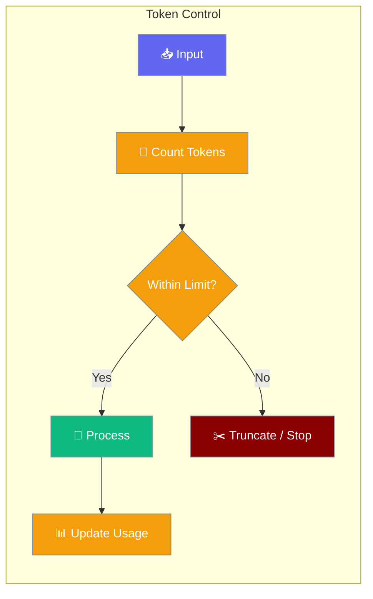
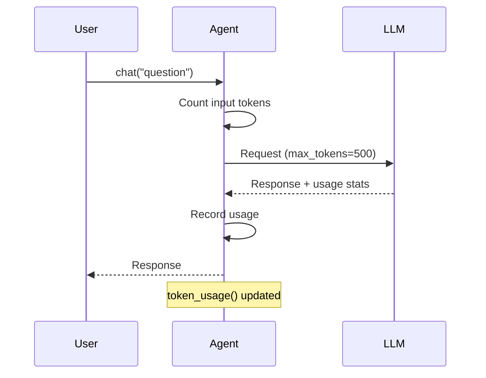

Set token limits so your Rust agents stay within budget and never generate unexpectedly long responses.


```mermaid
graph LR
    subgraph "Token Control"
        I[📥 Input] --> T[🔢 Count Tokens]
        T --> L{Within Limit?}
        L -->|Yes| P[🤖 Process]
        L -->|No| C[✂️ Truncate / Stop]
        P --> U[📊 Update Usage]
    end

    classDef input fill:#6366F1,stroke:#7C90A0,color:#fff
    classDef process fill:#F59E0B,stroke:#7C90A0,color:#fff
    classDef output fill:#10B981,stroke:#7C90A0,color:#fff
    classDef stop fill:#8B0000,stroke:#7C90A0,color:#fff

    class I input
    class T,L,U process
    class P output
    class C stop
```

## Quick Start

<Steps>
<Step title="Set Output Token Limit">
```rust
use praisonai::Agent;

let agent = Agent::new()
    .name("Assistant")
    .instructions("You are concise")
    .max_tokens(500)  // Limit output to 500 tokens
    .build()?;

let response = agent.chat("Explain quantum computing").await?;
println!("{}", response);
```
</Step>

<Step title="Track Token Usage">
```rust
use praisonai::Agent;

let agent = Agent::new()
    .name("Assistant")
    .instructions("You are helpful")
    .build()?;

let response = agent.chat("Hello").await?;

// Check usage after the call
let usage = agent.token_usage();
println!("Input tokens:  {}", usage.input_tokens);
println!("Output tokens: {}", usage.output_tokens);
println!("Total tokens:  {}", usage.total_tokens);
```
</Step>

<Step title="Set Context Window Limit">
```rust
use praisonai::Agent;

let agent = Agent::new()
    .name("Assistant")
    .instructions("You summarize long documents")
    .max_tokens(1000)      // Output limit
    .max_context(8192)     // Context window limit
    .build()?;
```
</Step>
</Steps>

---

## How It Works


```mermaid
sequenceDiagram
    participant User
    participant Agent
    participant LLM

    User->>Agent: chat("question")
    Agent->>Agent: Count input tokens
    Agent->>LLM: Request (max_tokens=500)
    LLM-->>Agent: Response + usage stats
    Agent->>Agent: Record usage
    Agent-->>User: Response
    Note over Agent: token_usage() updated
```

---

## Configuration Options

| Option | Type | Default | Description |
|--------|------|---------|-------------|
| `max_tokens` | `u32` | provider default | Maximum output tokens per request |
| `max_context` | `u32` | provider default | Maximum context window size |

---

## Common Patterns

### Budget-Aware Loops

Stop processing when cumulative cost gets too high:

```rust
use praisonai::Agent;

let agent = Agent::new()
    .name("Analyst")
    .instructions("Analyze text")
    .max_tokens(200)
    .build()?;

let questions = vec!["Q1", "Q2", "Q3"];
let token_limit = 1000u32;

for question in &questions {
    let usage = agent.token_usage();
    if usage.total_tokens >= token_limit {
        println!("Token budget exhausted after {} tokens", usage.total_tokens);
        break;
    }
    let answer = agent.chat(question).await?;
    println!("{}", answer);
}
```

### Verbose Usage Reporting

```rust
use praisonai::Agent;

let agent = Agent::new()
    .name("Reporter")
    .instructions("Generate reports")
    .max_tokens(800)
    .verbose(true)  // Logs token usage after each request
    .build()?;

agent.chat("Write a weekly summary").await?;
```

---

## Best Practices

<AccordionGroup>
  <Accordion title="Set max_tokens for predictable output">
    Always set `max_tokens` when you know the expected output length. For short answers use 200, for summaries 500–1000, for detailed analysis 2000+. This prevents runaway generation and unexpected costs.
  </Accordion>

  <Accordion title="Monitor cumulative usage">
    Call `agent.token_usage()` after each request to track total spend. In loops or multi-turn conversations, check the running total and stop when approaching your budget.
  </Accordion>

  <Accordion title="Respect context window limits">
    Set `max_context` slightly below the model's documented limit to leave headroom. Running at 100% of the context window can cause errors with some providers.
  </Accordion>

  <Accordion title="Use verbose mode in development">
    Enable `.verbose(true)` during development to see token counts logged automatically after each request. Disable in production to reduce noise.
  </Accordion>
</AccordionGroup>

---

## Related

<CardGroup cols={2}>
  <Card title="Budget" icon="wallet" href="/docs/rust/budget">
    Dollar-based spending limits
  </Card>
  <Card title="Context Management" icon="window-maximize" href="/docs/rust/context-management">
    Context window strategies
  </Card>
</CardGroup>
