Token management helps control costs and optimize usage.

```mermaid
graph LR
    subgraph "Token Management"
        I[📥 Input] --> T[🔢 Count]
        T --> L{Limit?}
        L --> |OK| P[🤖 Process]
        L --> |Over| C[✂️ Truncate]
    end
    
    classDef input fill:#6366F1,stroke:#7C90A0,color:#fff
    classDef process fill:#F59E0B,stroke:#7C90A0,color:#fff
    
    class I input
    class T,L,P,C process
```



## Quick Start

<Steps>
<Step title="Track Tokens">
```rust
use praisonai::Agent;

let agent = Agent::new()
    .name("Assistant")
    .max_tokens(4096)
    .build()?;

let response = agent.chat("Hello").await?;
let usage = agent.token_usage();

println!("Tokens: {}", usage.total_tokens);
```
</Step>
</Steps>

---

## Token Options

| Option | Description |
|--------|-------------|
| `max_tokens` | Maximum per request |
| `max_context` | Context window limit |
| `truncation` | How to handle overflow |

---

## Related

<CardGroup cols={2}>
  <Card title="Budget" icon="coins" href="/docs/rust/budget">
    Cost control
  </Card>
  <Card title="Context" icon="window-maximize" href="/docs/rust/context-management">
    Context management
  </Card>
</CardGroup>
