Token Management tracks and budgets token usage for LLM operations.

```mermaid
graph LR
    subgraph "Token Flow"
        I[📝 Input] --> C[🔢 Count]
        C --> B[📊 Budget]
    end
    
    classDef input fill:#6366F1,stroke:#7C90A0,color:#fff
    classDef process fill:#F59E0B,stroke:#7C90A0,color:#fff
    classDef output fill:#10B981,stroke:#7C90A0,color:#fff
    
    class I input
    class C process
    class B output
```



## Quick Start

<Steps>
<Step title="Create Token Budget">
```rust
use praisonai::rag::TokenBudget;

let budget = TokenBudget::new(16000);
println!("Available context: {}", budget.available_context());
```
</Step>

<Step title="Track Usage">
```rust
use praisonai::protocols::TokenUsage;

let usage = TokenUsage {
    prompt_tokens: 100,
    completion_tokens: 50,
    total_tokens: 150,
};
```
</Step>
</Steps>

---

## TokenBudget

```rust
pub struct TokenBudget {
    pub total: usize,
    pub system: usize,
    pub context: usize,
    pub response: usize,
    pub reserved: usize,
}
```

| Field | Type | Default | Description |
|-------|------|---------|-------------|
| `total` | `usize` | `8192` | Total available tokens |
| `system` | `usize` | `500` | System prompt tokens |
| `context` | `usize` | `4096` | Context tokens |
| `response` | `usize` | `2048` | Response tokens |
| `reserved` | `usize` | `500` | Reserved tokens |

---

## TokenUsage

```rust
pub struct TokenUsage {
    pub prompt_tokens: usize,
    pub completion_tokens: usize,
    pub total_tokens: usize,
}
```

---

## Utility Functions

| Function | Description |
|----------|-------------|
| `estimate_tokens(text)` | Estimate token count |
| `get_model_context_window(model)` | Get model context limit |

---

## Best Practices

<AccordionGroup>
  <Accordion title="Monitor usage">
    Track total_tokens to avoid exceeding limits.
  </Accordion>
  
  <Accordion title="Reserve for response">
    Always leave room for completion tokens.
  </Accordion>
</AccordionGroup>

---

## Related

<CardGroup cols={2}>
  <Card title="Budget" icon="calculator" href="/docs/rust/budget">
    Budget management
  </Card>
  <Card title="LLM" icon="brain" href="/docs/rust/llm">
    LLM configuration
  </Card>
</CardGroup>
