Tools extend agent capabilities beyond text generation.

```mermaid
graph LR
    subgraph "Tool Execution"
        A[🤖 Agent] --> B{Need Tool?}
        B -->|Yes| C[🔧 Call Tool]
        C --> D[📤 Result]
        D --> A
        B -->|No| E[✅ Response]
    end
    
    classDef agent fill:#8B0000,stroke:#7C90A0,color:#fff
    classDef decision fill:#F59E0B,stroke:#7C90A0,color:#fff
    classDef tool fill:#189AB4,stroke:#7C90A0,color:#fff
    classDef result fill:#10B981,stroke:#7C90A0,color:#fff
    
    class A agent
    class B decision
    class C,D tool
    class E result
```



## Quick Start

<Steps>

<Step title="Define Tool">
```rust
use praisonai::tool;

#[tool(description = "Search the web for information")]
async fn search(query: String) -> String {
    format!("Results for: {}", query)
}
```
</Step>

<Step title="Add to Agent">
```rust
use praisonai::Agent;

let agent = Agent::new()
    .instructions("Use search to help users")
    .tool(search)
    .build()?;

agent.chat("Search for Rust tutorials").await?;
```
</Step>

</Steps>

---

## #[tool] Macro

The `#[tool]` macro automatically:
- Generates tool schema from function signature
- Handles JSON serialization/deserialization
- Registers tool with the agent

```rust
#[tool(description = "Description shown to the LLM")]
async fn my_tool(
    param1: String,  // Required parameter
    param2: i32,     // Types are inferred
) -> String {
    // Return result as String
    format!("Got {} and {}", param1, param2)
}
```

---

## Parameter Types

Supported types in tool functions:

| Type | JSON Type | Example |
|------|-----------|---------|
| `String` | `string` | `"hello"` |
| `i32`, `i64` | `integer` | `42` |
| `f32`, `f64` | `number` | `3.14` |
| `bool` | `boolean` | `true` |

---

## Examples

### Calculator Tool

```rust
#[tool(description = "Add two numbers")]
async fn add(a: i32, b: i32) -> String {
    (a + b).to_string()
}

#[tool(description = "Multiply two numbers")]
async fn multiply(a: i32, b: i32) -> String {
    (a * b).to_string()
}

let agent = Agent::new()
    .instructions("Use calculator tools for math")
    .tool(add)
    .tool(multiply)
    .build()?;
```

### Web Request Tool

```rust
#[tool(description = "Fetch content from a URL")]
async fn fetch_url(url: String) -> String {
    // Using reqwest
    match reqwest::get(&url).await {
        Ok(resp) => resp.text().await.unwrap_or_default(),
        Err(e) => format!("Error: {}", e),
    }
}
```

### File Tool

```rust
#[tool(description = "Read a text file")]
async fn read_file(path: String) -> String {
    std::fs::read_to_string(&path)
        .unwrap_or_else(|e| format!("Error: {}", e))
}
```

---

## Manual Tool Implementation

For advanced control, implement the `Tool` trait directly:

```rust
use praisonai::tools::Tool;
use serde_json::{json, Value};

struct MyTool;

impl Tool for MyTool {
    fn name(&self) -> &str {
        "my_tool"
    }
    
    fn description(&self) -> &str {
        "Does something useful"
    }
    
    fn parameters(&self) -> Value {
        json!({
            "type": "object",
            "properties": {
                "input": {
                    "type": "string",
                    "description": "The input value"
                }
            },
            "required": ["input"]
        })
    }
    
    async fn execute(&self, args: Value) -> anyhow::Result<String> {
        let input = args["input"].as_str().unwrap_or("");
        Ok(format!("Processed: {}", input))
    }
}
```

---

## Best Practices

<AccordionGroup>
  <Accordion title="Clear descriptions">
    Write descriptions that help the LLM understand when to use the tool.
  </Accordion>
  
  <Accordion title="Handle errors gracefully">
    Return error messages as strings rather than panicking.
  </Accordion>
  
  <Accordion title="Keep tools focused">
    Each tool should do one thing well.
  </Accordion>
</AccordionGroup>

---

## Related

<CardGroup cols={2}>
  <Card title="Agent" icon="robot" href="/docs/rust/agent">
    Agent API reference
  </Card>
  <Card title="AgentTeam" icon="users" href="/docs/rust/agent-team">
    Multi-agent workflows
  </Card>
</CardGroup>
