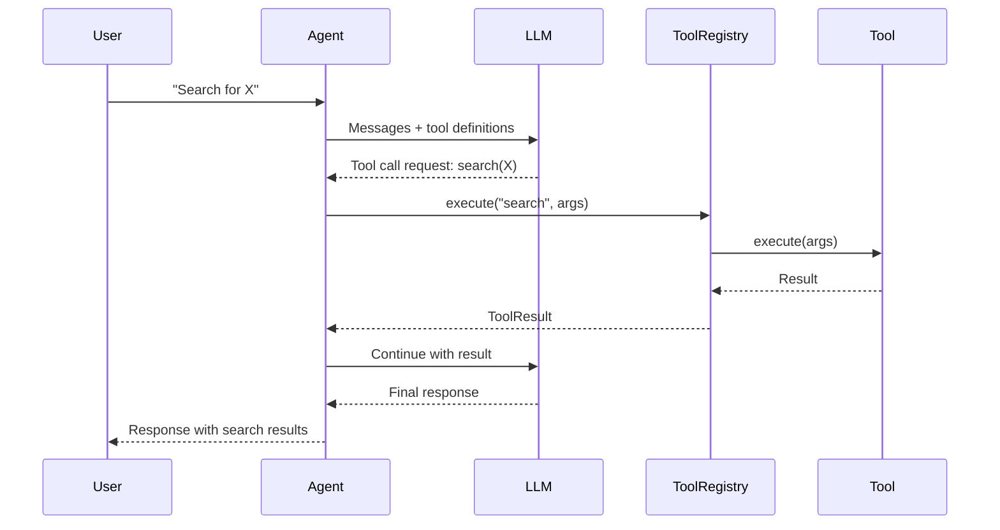

Tools extend agent capabilities by providing callable functions for actions like searching, calculating, or API calls.

```mermaid
graph LR
    subgraph "Tool System"
        A[🤖 Agent] --> T[🔧 ToolRegistry]
        T --> T1[Search]
        T --> T2[Calculate]
        T --> T3[Custom]
    end
    
    classDef agent fill:#6366F1,stroke:#7C90A0,color:#fff
    classDef registry fill:#F59E0B,stroke:#7C90A0,color:#fff
    classDef tool fill:#10B981,stroke:#7C90A0,color:#fff
    
    class A agent
    class T registry
    class T1,T2,T3 tool
```



## Quick Start

<Steps>
<Step title="Create a Tool with #[tool] Macro">
```rust
use praisonai::{Agent, tool};

#[tool]
fn search(query: String) -> String {
    format!("Results for: {}", query)
}

let agent = Agent::new()
    .name("Researcher")
    .instructions("Use the search tool when asked")
    .tool(search)
    .build()?;

let response = agent.chat("Search for Rust programming").await?;
```
</Step>

<Step title="Tool with Description">
```rust
use praisonai::tool;

#[tool(description = "Calculate a mathematical expression")]
fn calculate(expression: String) -> String {
    // Parse and evaluate expression
    format!("Result: {}", expression)
}
```
</Step>

<Step title="Async Tool">
```rust
use praisonai::tool;

#[tool(description = "Fetch data from a URL")]
async fn fetch_url(url: String) -> String {
    // Async HTTP request
    format!("Fetched content from: {}", url)
}
```
</Step>
</Steps>

---

## User Interaction Flow



---

## Tool Trait

Define custom tools by implementing the `Tool` trait:

```rust
#[async_trait]
pub trait Tool: Send + Sync {
    fn name(&self) -> &str;
    fn description(&self) -> &str;
    fn parameters_schema(&self) -> Value;
    async fn execute(&self, args: Value) -> Result<Value>;
    fn definition(&self) -> ToolDefinition;  // default impl
}
```

### Trait Methods

| Method | Signature | Description |
|--------|-----------|-------------|
| `name()` | `fn name(&self) -> &str` | Tool identifier |
| `description()` | `fn description(&self) -> &str` | Human-readable description |
| `parameters_schema()` | `fn parameters_schema(&self) -> Value` | JSON Schema for parameters |
| `execute(args)` | `async fn execute(&self, Value) -> Result<Value>` | Run the tool |
| `definition()` | `fn definition(&self) -> ToolDefinition` | Get LLM function definition |

---

## ToolRegistry

Manages a collection of tools for an agent.

```rust
pub struct ToolRegistry {
    tools: HashMap<String, Arc<dyn Tool>>,
}
```

### Methods

| Method | Signature | Description |
|--------|-----------|-------------|
| `new()` | `fn new() -> Self` | Create empty registry |
| `register(tool)` | `fn register(&mut self, impl Tool + 'static)` | Add a tool |
| `get(name)` | `fn get(&self, &str) -> Option<Arc<dyn Tool>>` | Get tool by name |
| `has(name)` | `fn has(&self, &str) -> bool` | Check if tool exists |
| `list()` | `fn list(&self) -> Vec<&str>` | List all tool names |
| `definitions()` | `fn definitions(&self) -> Vec<ToolDefinition>` | Get all definitions |
| `execute(name, args)` | `async fn execute(&self, &str, Value) -> Result<ToolResult>` | Run tool |
| `len()` | `fn len(&self) -> usize` | Number of tools |

---

## ToolResult

Result returned from tool execution.

```rust
pub struct ToolResult {
    pub name: String,
    pub value: Value,
    pub success: bool,
    pub error: Option<String>,
}
```

### Factory Methods

| Method | Signature | Description |
|--------|-----------|-------------|
| `success(name, value)` | `fn success(impl Into<String>, Value) -> Self` | Create success result |
| `failure(name, error)` | `fn failure(impl Into<String>, impl Into<String>) -> Self` | Create error result |

---

## ToolDefinition

Definition sent to LLM for function calling.

```rust
pub struct ToolDefinition {
    pub name: String,
    pub description: String,
    pub parameters: Value,  // JSON Schema
}
```

---

## Creating Tools

### Using #[tool] Macro (Recommended)

```rust
use praisonai::tool;

// Basic tool
#[tool]
fn greet(name: String) -> String {
    format!("Hello, {}!", name)
}

// With description
#[tool(description = "Add two numbers together")]
fn add(a: i32, b: i32) -> i32 {
    a + b
}

// Async tool
#[tool(description = "Fetch weather data")]
async fn get_weather(city: String) -> String {
    format!("Weather in {}: Sunny", city)
}
```

### Using FunctionTool

```rust
use praisonai::FunctionTool;
use serde_json::json;

let tool = FunctionTool::new(
    "greet",
    "Greet a person by name",
    json!({
        "type": "object",
        "properties": {
            "name": {"type": "string"}
        },
        "required": ["name"]
    }),
    |args| async move {
        let name = args["name"].as_str().unwrap_or("World");
        Ok(json!(format!("Hello, {}!", name)))
    }
);
```

### Implementing Tool Trait

```rust
use praisonai::{Tool, async_trait};
use serde_json::{Value, json};

struct MyTool;

#[async_trait]
impl Tool for MyTool {
    fn name(&self) -> &str { "my_tool" }
    
    fn description(&self) -> &str { "Custom tool implementation" }
    
    fn parameters_schema(&self) -> Value {
        json!({
            "type": "object",
            "properties": {
                "input": {"type": "string"}
            }
        })
    }
    
    async fn execute(&self, args: Value) -> Result<Value> {
        let input = args["input"].as_str().unwrap_or("");
        Ok(json!(format!("Processed: {}", input)))
    }
}
```

---

## Multiple Tools Example

```rust
use praisonai::{Agent, tool};

#[tool(description = "Search the web for information")]
fn web_search(query: String) -> String {
    format!("Web results for: {}", query)
}

#[tool(description = "Calculate a math expression")]
fn calculate(expr: String) -> String {
    format!("Calculation: {} = 42", expr)
}

#[tool(description = "Get current time")]
fn get_time() -> String {
    "Current time: 12:34 PM".to_string()
}

let agent = Agent::new()
    .name("MultiTool Agent")
    .instructions("Use available tools to help the user")
    .tool(web_search)
    .tool(calculate)
    .tool(get_time)
    .build()?;

let response = agent.chat("What time is it and search for today's weather").await?;
```

---

## Best Practices

<AccordionGroup>
  <Accordion title="Use descriptive tool names">
    Names should clearly indicate what the tool does: `web_search`, `calculate_tax`, `send_email`.
  </Accordion>
  
  <Accordion title="Write clear descriptions">
    The LLM uses descriptions to decide when to call tools. Be specific and clear.
  </Accordion>
  
  <Accordion title="Handle errors gracefully">
    Return meaningful error messages that help the agent recover.
  </Accordion>
  
  <Accordion title="Keep tools focused">
    Each tool should do one thing well. Compose multiple tools for complex operations.
  </Accordion>
</AccordionGroup>

---

## Related

<CardGroup cols={2}>
  <Card title="Agent" icon="robot" href="/docs/rust/agent">
    Agent API
  </Card>
  <Card title="MCP" icon="plug" href="/docs/rust/mcp">
    Model Context Protocol
  </Card>
</CardGroup>
