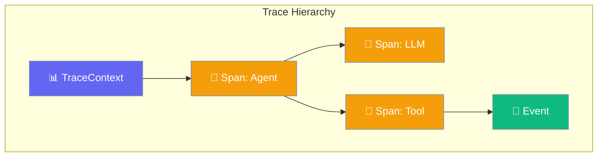
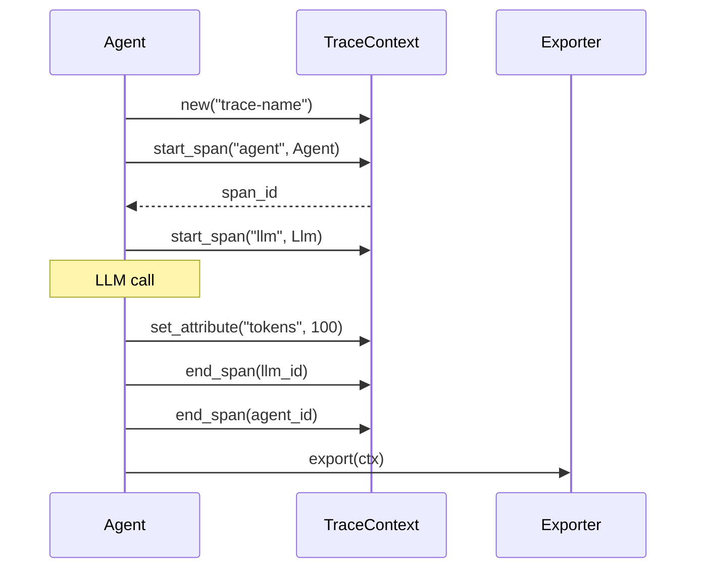

Tracing provides observability for agent execution, tracking spans across LLM calls, tool executions, and workflows.



## Quick Start

<Steps>
<Step title="Create a Trace">
```rust
use praisonai::trace::{TraceContext, SpanKind};

let mut ctx = TraceContext::new("agent-execution");

// Start a span
let span_id = ctx.start_span("process-request", SpanKind::Agent);

// Do work...
ctx.add_event("received_input");
ctx.set_attribute("input_length", 42);

// End span
ctx.end_span(&span_id);

println!("Trace completed with {} spans", ctx.span_count());
```
</Step>

<Step title="Nested Spans">
```rust
use praisonai::trace::{TraceContext, SpanKind};

let mut ctx = TraceContext::new("workflow");

let workflow_span = ctx.start_span("workflow", SpanKind::Workflow);

    let agent_span = ctx.start_span("agent-task", SpanKind::Agent);
    
        let llm_span = ctx.start_span("llm-call", SpanKind::Llm);
        // LLM call happens here
        ctx.end_span(&llm_span);
    
    ctx.end_span(&agent_span);

ctx.end_span(&workflow_span);

// Export trace
let json = ctx.to_json();
```
</Step>
</Steps>

---

## User Interaction Flow



---

## TraceContext

Main tracing context that manages spans.

```rust
pub struct TraceContext {
    pub id: String,
    pub name: String,
    pub attributes: HashMap<String, Value>,
}
```

### Methods

| Method | Signature | Description |
|--------|-----------|-------------|
| `new(name)` | `fn new(impl Into<String>) -> Self` | Create trace context |
| `elapsed()` | `fn elapsed(&self) -> Duration` | Time since trace start |
| `start_span(name, kind)` | `fn start_span(&mut self, impl Into<String>, SpanKind) -> String` | Start span, returns ID |
| `end_span(id)` | `fn end_span(&mut self, &str)` | End span by ID |
| `current_span_id()` | `fn current_span_id(&self) -> Option<&str>` | Get current span ID |
| `get_span(id)` | `fn get_span(&self, &str) -> Option<&Span>` | Get span by ID |
| `add_event(name)` | `fn add_event(&mut self, impl Into<String>)` | Add event to current span |
| `set_attribute(key, value)` | `fn set_attribute(&mut self, impl Into<String>, impl Serialize)` | Set attribute on current |
| `spans()` | `fn spans(&self) -> &[Span]` | Get all spans |
| `span_count()` | `fn span_count(&self) -> usize` | Number of spans |
| `to_json()` | `fn to_json(&self) -> Value` | Export as JSON |

---

## SpanKind

Type of operation being traced.

```rust
pub enum SpanKind {
    Internal,   // default - Internal operation
    Llm,        // LLM call
    Tool,       // Tool execution
    Agent,      // Agent processing
    Workflow,   // Workflow execution
    Memory,     // Memory operation
    Network,    // Network/API call
    Custom,     // Custom operation
}
```

| Kind | Use Case |
|------|----------|
| `Internal` | General internal operations |
| `Llm` | LLM API calls |
| `Tool` | Tool executions |
| `Agent` | Agent message processing |
| `Workflow` | Multi-agent workflows |
| `Memory` | Memory read/write |
| `Network` | External API calls |

---

## SpanStatus

Status of a span.

```rust
pub enum SpanStatus {
    Unset,  // default - Not set
    Ok,     // Success
    Error,  // Error occurred
}
```

---

## Span

Represents a unit of work.

```rust
pub struct Span {
    pub id: String,
    pub parent_id: Option<String>,
    pub trace_id: String,
    pub name: String,
    pub kind: SpanKind,
    pub status: SpanStatus,
    pub start_offset: Duration,
    pub end_offset: Option<Duration>,
    pub duration: Option<Duration>,
    pub attributes: HashMap<String, Value>,
    pub events: Vec<SpanEvent>,
    pub error_message: Option<String>,
}
```

### Methods

| Method | Signature | Description |
|--------|-----------|-------------|
| `new(trace_id, name, kind, offset)` | `fn new(...) -> Self` | Create span |
| `with_parent(id)` | `fn with_parent(self, impl Into<String>) -> Self` | Set parent |
| `set_attribute(key, value)` | `fn set_attribute(&mut self, impl Into<String>, impl Serialize)` | Add attribute |
| `add_event(event)` | `fn add_event(&mut self, SpanEvent)` | Add event |
| `end(offset)` | `fn end(&mut self, Duration)` | End span |
| `set_error(message)` | `fn set_error(&mut self, impl Into<String>)` | Mark as error |
| `is_ended()` | `fn is_ended(&self) -> bool` | Check if ended |

---

## SpanEvent

Events within a span.

```rust
pub struct SpanEvent {
    pub name: String,
    pub timestamp: Duration,
    pub attributes: HashMap<String, Value>,
}
```

### Methods

| Method | Signature | Description |
|--------|-----------|-------------|
| `new(name, timestamp)` | `fn new(impl Into<String>, Duration) -> Self` | Create event |
| `with_attribute(key, value)` | `fn with_attribute(self, impl Into<String>, impl Serialize) -> Self` | Add attribute |

---

## TraceExporter Trait

Export traces to various backends.

```rust
pub trait TraceExporter: Send + Sync {
    fn export(&self, trace: &TraceContext) -> Result<(), Box<dyn Error>>;
}
```

### Built-in Exporters

| Exporter | Description |
|----------|-------------|
| `ConsoleExporter` | Prints traces to stdout |

---

## Example: Full Tracing

```rust
use praisonai::trace::{TraceContext, SpanKind, ConsoleExporter, TraceExporter};

let mut ctx = TraceContext::new("agent-request");

// Agent span
let agent_span = ctx.start_span("handle-request", SpanKind::Agent);
ctx.set_attribute("user_id", "user-123");

    // LLM span
    let llm_span = ctx.start_span("gpt-4-call", SpanKind::Llm);
    ctx.set_attribute("model", "gpt-4o");
    ctx.set_attribute("tokens", 150);
    ctx.add_event("response_received");
    ctx.end_span(&llm_span);

    // Tool span
    let tool_span = ctx.start_span("search-tool", SpanKind::Tool);
    ctx.set_attribute("query", "rust programming");
    ctx.end_span(&tool_span);

ctx.end_span(&agent_span);

// Export
let exporter = ConsoleExporter;
exporter.export(&ctx).unwrap();
```

---

## Best Practices

<AccordionGroup>
  <Accordion title="Use appropriate SpanKind">
    Categorize spans correctly for better visualization and filtering.
  </Accordion>
  
  <Accordion title="Add meaningful attributes">
    Include model names, token counts, user IDs - data useful for debugging.
  </Accordion>
  
  <Accordion title="Use events for milestones">
    Events mark important points within a span without creating new spans.
  </Accordion>
  
  <Accordion title="Always end spans">
    Use try/finally patterns or RAII to ensure spans are always closed.
  </Accordion>
</AccordionGroup>

---

## Related

<CardGroup cols={2}>
  <Card title="Telemetry" icon="signal" href="/docs/rust/telemetry">
    Metrics and telemetry
  </Card>
  <Card title="Callbacks" icon="phone" href="/docs/rust/callbacks">
    Event callbacks
  </Card>
</CardGroup>
