Tracing captures agent execution flow for debugging and performance analysis.

```mermaid
graph LR
    subgraph "Tracing Flow"
        A[🤖 Agent] --> S1[📊 Span 1]
        S1 --> S2[📊 Span 2]
        S2 --> E[📤 Export]
    end
    
    classDef agent fill:#6366F1,stroke:#7C90A0,color:#fff
    classDef span fill:#F59E0B,stroke:#7C90A0,color:#fff
    classDef export fill:#10B981,stroke:#7C90A0,color:#fff
    
    class A agent
    class S1,S2 span
    class E export
```



## Quick Start

<Steps>
<Step title="Create Trace">
```rust
use praisonai::trace::{TraceContext, SpanKind};

let mut ctx = TraceContext::new("my-agent");

// Start a span
let span_id = ctx.start_span("chat", SpanKind::Agent);

// ... do work ...

// End the span
ctx.end_span(&span_id);
```
</Step>

<Step title="With Exporter">
```rust
use praisonai::trace::{Tracer, ConsoleExporter, SpanKind};

let tracer = Tracer::new();
tracer.add_exporter(ConsoleExporter);

let trace_id = tracer.start_trace("agent-run");
let span_id = tracer.start_span(&trace_id, "process", SpanKind::Internal);

// Work...

tracer.end_span(&trace_id, &span_id.unwrap());
tracer.end_trace(&trace_id);
```
</Step>
</Steps>

---

## How It Works


---

## SpanKind

Categorize spans by operation type:

```rust
use praisonai::trace::SpanKind;

let span = ctx.start_span("operation", SpanKind::Llm);
```

| Kind | Description |
|------|-------------|
| `Internal` | Internal operation (default) |
| `Llm` | LLM API call |
| `Tool` | Tool execution |
| `Agent` | Agent execution |
| `Workflow` | Workflow step |
| `Memory` | Memory operation |
| `Network` | Network/API call |
| `Custom` | Custom operation |

---

## SpanStatus

```rust
use praisonai::trace::SpanStatus;
```

| Status | Description |
|--------|-------------|
| `Unset` | Not yet set (default) |
| `Ok` | Success |
| `Error` | Error occurred |

---

## Span

```rust
pub struct Span {
    pub id: String,
    pub parent_id: Option<String>,
    pub trace_id: String,
    pub name: String,
    pub kind: SpanKind,
    pub status: SpanStatus,
    pub attributes: HashMap<String, Value>,
    pub events: Vec<SpanEvent>,
    pub error_message: Option<String>,
}
```

| Method | Description |
|--------|-------------|
| `set_attribute(key, value)` | Add attribute |
| `add_event(event)` | Add event |
| `set_error(message)` | Mark as error |
| `end(offset)` | End the span |

---

## TraceContext

Manages spans within a trace:

```rust
use praisonai::trace::TraceContext;

let mut ctx = TraceContext::new("my-trace");

// Start nested spans
let parent = ctx.start_span("parent", SpanKind::Workflow);
let child = ctx.start_span("child", SpanKind::Agent);

// Add event to current span
ctx.add_event("checkpoint");

// Set attribute on current span
ctx.set_attribute("model", "gpt-4o");

ctx.end_span(&child);
ctx.end_span(&parent);

// Export as JSON
let json = ctx.to_json();
```

---

## Exporters

### ConsoleExporter

```rust
use praisonai::trace::{Tracer, ConsoleExporter};

let tracer = Tracer::new();
tracer.add_exporter(ConsoleExporter);
```

### JsonFileExporter

```rust
use praisonai::trace::JsonFileExporter;

tracer.add_exporter(JsonFileExporter::new("/path/to/trace.json"));
```

### Custom Exporter

```rust
use praisonai::trace::{TraceExporter, TraceContext};

struct MyExporter;

impl TraceExporter for MyExporter {
    fn export(&self, trace: &TraceContext) -> Result<(), Box<dyn Error>> {
        // Custom export logic
        Ok(())
    }
}
```

---

## ContextTraceEmitter

For event-based tracing (replay/debugging):

```rust
use praisonai::trace::{ContextTraceEmitter, ContextListSink};

let mut emitter = ContextTraceEmitter::with_list_sink();

// Emit events
emitter.agent_start("agent-1", "Researcher", "Analyze data");
emitter.tool_start("web_search", serde_json::json!({"query": "AI"}));
emitter.tool_end("web_search", serde_json::json!({"results": []}), 150);
emitter.agent_end("agent-1", "Researcher", "Analysis complete", 2000);

// Get recorded events
let events = emitter.events();
```

---

## ContextEventType

| Type | Description |
|------|-------------|
| `AgentStart` | Agent started |
| `AgentEnd` | Agent completed |
| `ToolStart` | Tool call started |
| `ToolEnd` | Tool call completed |
| `LlmStart` | LLM request started |
| `LlmEnd` | LLM response received |
| `MemoryOp` | Memory operation |
| `WorkflowStep` | Workflow step |
| `Error` | Error occurred |
| `Custom` | Custom event |

---

## Best Practices

<AccordionGroup>
  <Accordion title="Name spans descriptively">
    Use clear names: `llm_call`, `tool_execution`, `memory_search`.
  </Accordion>
  
  <Accordion title="Add meaningful attributes">
    Include context: model name, tool name, input length.
  </Accordion>
  
  <Accordion title="Use appropriate SpanKind">
    Categorize correctly for filtering and analysis.
  </Accordion>
  
  <Accordion title="Set error status with message">
    Always include error message when setting `SpanStatus::Error`.
  </Accordion>
</AccordionGroup>

---

## Related

<CardGroup cols={2}>
  <Card title="Telemetry" icon="chart-line" href="/docs/rust/telemetry">
    Metrics and monitoring
  </Card>
  <Card title="Agent" icon="robot" href="/docs/rust/agent">
    Agent API
  </Card>
</CardGroup>
