Tracing captures the execution flow of agents, enabling debugging and performance analysis.

```mermaid
graph LR
    subgraph "Tracing Flow"
        A[🚀 Agent Start] --> B[📊 Span Created]
        B --> C[🔧 Operations]
        C --> D[📤 Span Exported]
    end
    
    classDef input fill:#6366F1,stroke:#7C90A0,color:#fff
    classDef process fill:#F59E0B,stroke:#7C90A0,color:#fff
    classDef output fill:#10B981,stroke:#7C90A0,color:#fff
    
    class A input
    class B,C process
    class D output
```



## Quick Start

<Steps>
<Step title="Enable Tracing">
```rust
use praisonai::trace::{TraceContext, Span};

let ctx = TraceContext::new("my-agent");
let span = ctx.start_span("chat");

// Agent work here...
span.end();
```
</Step>

<Step title="With Exporter">
```rust
use praisonai::trace::{TraceContext, ConsoleExporter};

let ctx = TraceContext::new("agent")
    .with_exporter(ConsoleExporter::new());

let span = ctx.start_span("process")
    .with_attribute("input", "user query");

// Work...
span.set_status(SpanStatus::Ok);
span.end();
```
</Step>
</Steps>

---

## How It Works


| Step | Description |
|------|-------------|
| Start Span | Create a named span for an operation |
| Execute | Run the actual agent work |
| Add Events | Log important events within the span |
| End Span | Mark completion with status |
| Export | Send trace data to external systems |

---

## Configuration Options

```rust
use praisonai::trace::{TraceContext, SpanKind};

let ctx = TraceContext::new("agent-name")
    .service_name("my-service")
    .with_sampling_rate(0.5);

let span = ctx.start_span("operation")
    .with_kind(SpanKind::Internal)
    .with_attribute("key", "value");
```

| Option | Type | Default | Description |
|--------|------|---------|-------------|
| `service_name` | `str` | `"praisonai"` | Service identifier |
| `sampling_rate` | `f64` | `1.0` | Trace sampling rate (0-1) |
| `exporter` | `Exporter` | `None` | Export destination |

### SpanKind

| Kind | Use Case |
|------|----------|
| `Internal` | Internal operations |
| `Client` | Outgoing requests |
| `Server` | Incoming requests |
| `Producer` | Message sending |
| `Consumer` | Message receiving |

---

## Common Patterns

### Nested Spans

```rust
let parent = ctx.start_span("agent_run");

let child = ctx.start_span("llm_call")
    .with_parent(&parent);
// LLM work...
child.end();

parent.end();
```

### Adding Events

```rust
let span = ctx.start_span("process");

span.add_event("received_input", [
    ("length", "150"),
]);

span.add_event("tool_called", [
    ("tool", "web_search"),
]);

span.end();
```

---

## Best Practices

<AccordionGroup>
  <Accordion title="Use descriptive span names">
    Name spans after the operation: `llm_call`, `tool_execution`, `memory_search`.
  </Accordion>
  
  <Accordion title="Add meaningful attributes">
    Include context like model name, tool name, or input length.
  </Accordion>
  
  <Accordion title="Set proper status">
    Use `SpanStatus::Ok` for success, `SpanStatus::Error` for failures with messages.
  </Accordion>
</AccordionGroup>

---

## Related

<CardGroup cols={2}>
  <Card title="Telemetry" icon="chart-line" href="/docs/rust/telemetry">
    Performance monitoring
  </Card>
  <Card title="Agent" icon="robot" href="/docs/rust/agent">
    Agent API
  </Card>
</CardGroup>
