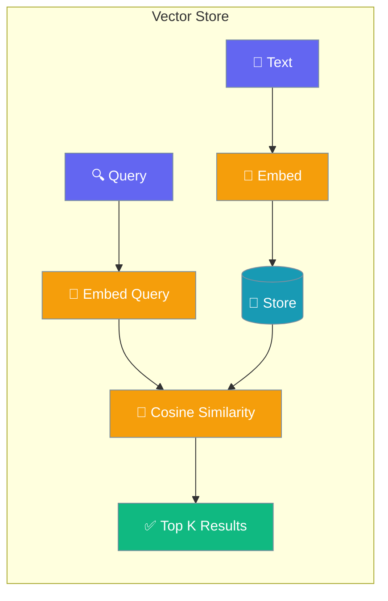
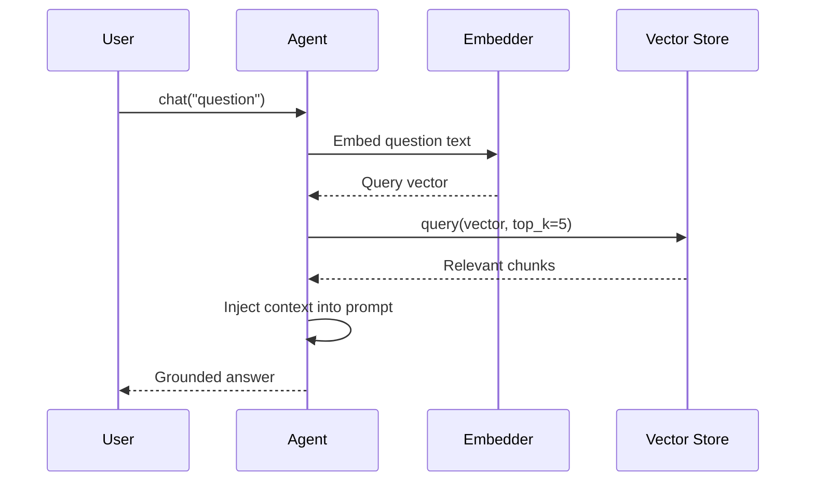
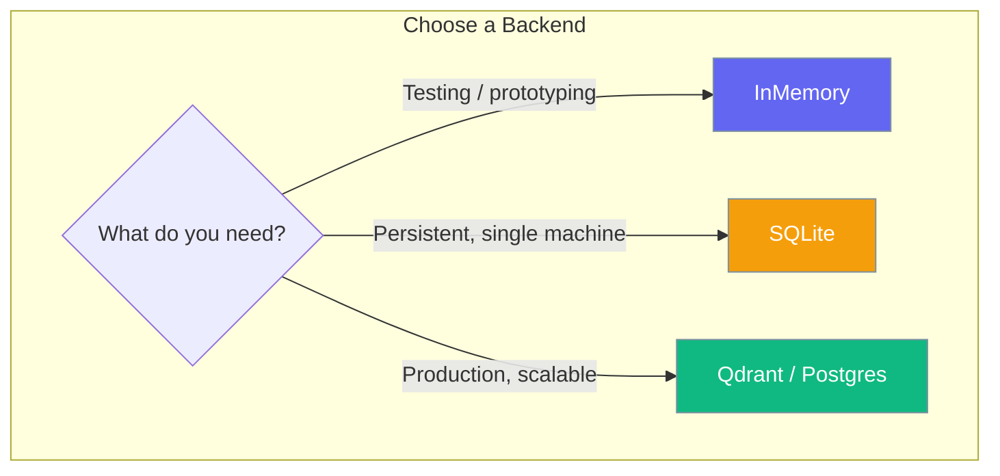

Give your Rust agents semantic search — store text as vector embeddings and retrieve the most relevant chunks by meaning, not just keywords.


```mermaid
graph LR
    subgraph "Vector Store"
        T[📝 Text] --> E[🧠 Embed]
        E --> S[(💾 Store)]
        Q[🔍 Query] --> QE[🧠 Embed Query]
        QE --> Sim[📐 Cosine Similarity]
        S --> Sim
        Sim --> R[✅ Top K Results]
    end

    classDef input fill:#6366F1,stroke:#7C90A0,color:#fff
    classDef process fill:#F59E0B,stroke:#7C90A0,color:#fff
    classDef store fill:#189AB4,stroke:#7C90A0,color:#fff
    classDef output fill:#10B981,stroke:#7C90A0,color:#fff

    class T,Q input
    class E,QE,Sim process
    class S store
    class R output
```

## Quick Start

<Steps>
<Step title="Agent with Knowledge (Simplest)">
The easiest way to use vector storage — attach files to an agent and it handles indexing automatically.

```rust
use praisonai::{Agent, KnowledgeConfig, VectorStore};

let knowledge = KnowledgeConfig::new()
    .source("docs/")
    .vector_store(VectorStore::InMemory);

let agent = Agent::new()
    .name("Researcher")
    .instructions("Answer questions using the provided documents")
    .knowledge(knowledge)
    .build()?;

let answer = agent.chat("How do I configure authentication?").await?;
println!("{}", answer);
```
</Step>

<Step title="Persistent Storage with SQLite">
Switch to SQLite for data that survives process restarts.

```rust
use praisonai::{Agent, KnowledgeConfig, VectorStore};

let knowledge = KnowledgeConfig::new()
    .source("docs/")
    .vector_store(VectorStore::SQLite {
        path: "knowledge.db".into()
    });

let agent = Agent::new()
    .name("Assistant")
    .knowledge(knowledge)
    .build()?;
```
</Step>

<Step title="Production with Qdrant">
Use a dedicated vector database for production-scale deployments.

```rust
use praisonai::{Agent, KnowledgeConfig, VectorStore};

let knowledge = KnowledgeConfig::new()
    .source("docs/")
    .vector_store(VectorStore::Qdrant {
        url: "http://localhost:6333".into(),
        collection: "my_docs".into(),
    });

let agent = Agent::new()
    .name("Assistant")
    .knowledge(knowledge)
    .build()?;
```
</Step>
</Steps>

---

## How It Works


```mermaid
sequenceDiagram
    participant User
    participant Agent
    participant Embed as Embedder
    participant VS as Vector Store

    User->>Agent: chat("question")
    Agent->>Embed: Embed question text
    Embed-->>Agent: Query vector
    Agent->>VS: query(vector, top_k=5)
    VS-->>Agent: Relevant chunks
    Agent->>Agent: Inject context into prompt
    Agent-->>User: Grounded answer
```

---

## Vector Store Options

Choose the right backend for your needs:


```mermaid
graph TB
    subgraph "Choose a Backend"
        Start{What do you need?}
        Start -->|Testing / prototyping| IM[InMemory]
        Start -->|Persistent, single machine| SQ[SQLite]
        Start -->|Production, scalable| QD[Qdrant / Postgres]
    end

    classDef dev fill:#6366F1,stroke:#7C90A0,color:#fff
    classDef local fill:#F59E0B,stroke:#7C90A0,color:#fff
    classDef prod fill:#10B981,stroke:#7C90A0,color:#fff

    class IM dev
    class SQ local
    class QD prod
```

| Store | Type | Use Case |
|-------|------|----------|
| `VectorStore::InMemory` | In-process | Development, testing, short-lived agents |
| `VectorStore::SQLite { path }` | Local file | Persistent, single-machine deployments |
| `VectorStore::Postgres { url }` | Remote DB | Production, multi-instance |
| `VectorStore::Qdrant { url, collection }` | Dedicated vector DB | High-scale production |

---

## Common Patterns

### Multiple Document Sources

```rust
use praisonai::{Agent, KnowledgeConfig, VectorStore};

let knowledge = KnowledgeConfig::new()
    .source("docs/api.pdf")
    .source("docs/guide.md")
    .source("https://docs.example.com/faq")
    .vector_store(VectorStore::InMemory);

let agent = Agent::new()
    .name("Support Agent")
    .instructions("Answer customer questions from the documentation")
    .knowledge(knowledge)
    .build()?;
```

### Namespace Isolation

Keep different datasets separate within the same store.

```rust
use praisonai::{Agent, KnowledgeConfig, VectorStore};

// Agent for English docs
let en_knowledge = KnowledgeConfig::new()
    .source("docs/en/")
    .namespace("en")
    .vector_store(VectorStore::SQLite { path: "kb.db".into() });

// Agent for Spanish docs (same DB, different namespace)
let es_knowledge = KnowledgeConfig::new()
    .source("docs/es/")
    .namespace("es")
    .vector_store(VectorStore::SQLite { path: "kb.db".into() });
```

---

## Best Practices

<AccordionGroup>
  <Accordion title="Start with InMemory, migrate when ready">
    Use `VectorStore::InMemory` during development — no setup required. When you need persistence or scale, switch to SQLite or Qdrant by changing one line. The agent code stays identical.
  </Accordion>

  <Accordion title="Use namespaces for multi-tenant data">
    Namespaces let multiple agents share one database without data bleeding between them. Use a per-user or per-project namespace: `"user:alice"`, `"project:v2"`.
  </Accordion>

  <Accordion title="Chunk documents for better retrieval">
    Very long documents score poorly in semantic search. Split them into 500–1000 character chunks so the embedder captures focused meaning per chunk. Use the chunking options in `KnowledgeConfig` to control this automatically.
  </Accordion>

  <Accordion title="Prefer Qdrant for production">
    For production workloads with thousands of documents, Qdrant delivers faster approximate nearest-neighbour search than a full table scan in SQLite or Postgres.
  </Accordion>
</AccordionGroup>

---

## Related

<CardGroup cols={2}>
  <Card title="Knowledge" icon="book" href="/docs/rust/knowledge">
    Full knowledge base configuration
  </Card>
  <Card title="Embeddings" icon="vector-square" href="/docs/rust/embeddings">
    Generate and manage embeddings
  </Card>
</CardGroup>
