Vector Store provides storage and retrieval of embedding vectors for similarity search.

```mermaid
graph LR
    subgraph "Vector Store"
        T[📝 Text] --> E[🔢 Embedding]
        E --> S[💾 Store]
        S --> Q[🔍 Search]
    end
    
    classDef input fill:#6366F1,stroke:#7C90A0,color:#fff
    classDef process fill:#F59E0B,stroke:#7C90A0,color:#fff
    classDef output fill:#10B981,stroke:#7C90A0,color:#fff
    
    class T input
    class E,S process
    class Q output
```



## Quick Start

<Steps>
<Step title="Create Vector Store">
```rust
use praisonai::knowledge::InMemoryVectorStore;

let store = InMemoryVectorStore::new();
```
</Step>

<Step title="Add Records">
```rust
use praisonai::knowledge::VectorRecord;

let record = VectorRecord::new(
    "doc-1",
    "Document content here",
    vec![0.1, 0.2, 0.3, ...]  // embedding
);

store.add(record).await?;
```
</Step>

<Step title="Search">
```rust
let query_embedding = vec![0.1, 0.2, 0.3, ...];
let results = store.search(&query_embedding, 5).await?;

for result in results {
    println!("{}: {} ({})", result.id, result.text, result.score);
}
```
</Step>
</Steps>

---

## VectorStoreProtocol

```rust
#[async_trait]
pub trait VectorStoreProtocol: Send + Sync {
    async fn add(&mut self, record: VectorRecord) -> Result<String>;
    async fn search(&self, query: &[f32], limit: usize) -> Result<Vec<SearchResultItem>>;
    async fn get(&self, id: &str) -> Result<Option<VectorRecord>>;
    async fn delete(&mut self, id: &str) -> Result<bool>;
    async fn get_all(&self, limit: usize) -> Result<Vec<VectorRecord>>;
    async fn clear(&mut self) -> Result<()>;
    fn len(&self) -> usize;
    fn is_empty(&self) -> bool;
}
```

| Method | Description |
|--------|-------------|
| `add` | Add a record to the store |
| `search` | Find similar records |
| `get` | Get record by ID |
| `delete` | Delete record by ID |
| `clear` | Remove all records |

---

## VectorRecord

```rust
pub struct VectorRecord {
    pub id: String,
    pub text: String,
    pub embedding: Vec<f32>,
    pub metadata: HashMap<String, String>,
}
```

---

## Best Practices

<AccordionGroup>
  <Accordion title="Use consistent embeddings">
    Ensure all embeddings use the same model and dimensions.
  </Accordion>
  
  <Accordion title="Add metadata for filtering">
    Include metadata like source, date for advanced filtering.
  </Accordion>
</AccordionGroup>

---

## Related

<CardGroup cols={2}>
  <Card title="Embeddings" icon="code" href="/docs/rust/embedding">
    Embedding generation
  </Card>
  <Card title="Knowledge" icon="brain" href="/docs/rust/knowledge">
    Knowledge management
  </Card>
</CardGroup>
