Vector stores enable semantic search over embeddings.

```mermaid
graph LR
    subgraph "Vector Store"
        E[🔢 Embeddings] --> V[📦 Store]
        Q[❓ Query] --> V
        V --> R[📄 Results]
    end
    
    classDef input fill:#6366F1,stroke:#7C90A0,color:#fff
    classDef store fill:#F59E0B,stroke:#7C90A0,color:#fff
    classDef output fill:#10B981,stroke:#7C90A0,color:#fff
    
    class E,Q input
    class V store
    class R output
```



## Quick Start

<Steps>
<Step title="Use Vector Store">
```rust
use praisonai::{Agent, KnowledgeConfig, VectorStore};

let config = KnowledgeConfig::new()
    .source("docs/")
    .vector_store(VectorStore::InMemory);

let agent = Agent::new()
    .name("Assistant")
    .knowledge(config)
    .build()?;
```
</Step>
</Steps>

---

## Vector Store Options

| Store | Description |
|-------|-------------|
| `InMemory` | Fast, non-persistent |
| `SQLite` | Persistent, local |
| `Postgres` | Production-ready |
| `Qdrant` | Specialized vector DB |

---

## Related

<CardGroup cols={2}>
  <Card title="Knowledge" icon="book" href="/docs/rust/knowledge">
    Knowledge base
  </Card>
  <Card title="Embeddings" icon="vector-square" href="/docs/rust/embeddings">
    Create embeddings
  </Card>
</CardGroup>
