VideoAgent generates videos from text prompts using AI models like Sora.

```mermaid
graph LR
    subgraph "Video Generation"
        P[📝 Prompt] --> A[🤖 VideoAgent]
        A --> V[🎬 Video]
    end
    
    classDef input fill:#6366F1,stroke:#7C90A0,color:#fff
    classDef agent fill:#F59E0B,stroke:#7C90A0,color:#fff
    classDef output fill:#10B981,stroke:#7C90A0,color:#fff
    
    class P input
    class A agent
    class V output
```



## Quick Start

<Steps>
<Step title="Create Video Agent">
```rust
use praisonai::agents::VideoAgent;

let agent = VideoAgent::new()
    .name("VideoCreator")
    .model("openai/sora-2")
    .build()?;
```
</Step>

<Step title="Generate Video">
```rust
let result = agent.generate("A cat playing in a garden")?;

match result.status {
    VideoStatus::Pending => println!("Generation started: {}", result.id),
    VideoStatus::Completed => println!("Video: {:?}", result.url),
    VideoStatus::Failed => eprintln!("Error: {:?}", result.error),
    _ => {}
}
```
</Step>

<Step title="With Configuration">
```rust
use praisonai::agents::{VideoAgent, VideoConfig};

let config = VideoConfig::new()
    .seconds("16")
    .size("1280x720");

let agent = VideoAgent::new()
    .config(config)
    .build()?;
```
</Step>
</Steps>

---

## Configuration Options

```rust
use praisonai::agents::VideoConfig;

let config = VideoConfig::new()
    .seconds("8")
    .size("1280x720");
```

| Option | Type | Default | Description |
|--------|------|---------|-------------|
| `seconds` | `String` | `"8"` | Video duration |
| `size` | `Option<String>` | `None` | Video dimensions |
| `timeout` | `u32` | `600` | Timeout in seconds |
| `poll_interval` | `u32` | `10` | Polling interval (sec) |
| `max_wait_time` | `u32` | `600` | Max wait time (sec) |

---

## Video Status

```rust
pub enum VideoStatus {
    Pending,
    Processing,
    Completed,
    Failed,
}
```

| Status | Description |
|--------|-------------|
| `Pending` | Generation started |
| `Processing` | In progress |
| `Completed` | Ready to download |
| `Failed` | Generation failed |

---

## Best Practices

<AccordionGroup>
  <Accordion title="Start with short videos">
    Use 5-8 seconds initially for faster iterations.
  </Accordion>
  
  <Accordion title="Handle async generation">
    Video generation is asynchronous; poll status until complete.
  </Accordion>
</AccordionGroup>

---

## Related

<CardGroup cols={2}>
  <Card title="Image" icon="image" href="/docs/rust/image">
    Image generation
  </Card>
  <Card title="Audio" icon="microphone" href="/docs/rust/audio">
    Audio generation
  </Card>
</CardGroup>
