Video capabilities for agents to understand and generate video.

```mermaid
graph LR
    subgraph "Video"
        V[🎬 Video] --> A[🤖 Agent]
        A --> O[📤 Output]
    end
    
    classDef video fill:#6366F1,stroke:#7C90A0,color:#fff
    classDef agent fill:#F59E0B,stroke:#7C90A0,color:#fff
    classDef output fill:#10B981,stroke:#7C90A0,color:#fff
    
    class V video
    class A agent
    class O output
```



## Quick Start

<Steps>
<Step title="Analyze Video">
```rust
use praisonai::{Agent, tool};

#[tool]
async fn analyze_video(path: String) -> String {
    // Video analysis
    video::analyze(&path).await
}

let agent = Agent::new()
    .name("Video Analyst")
    .tool(analyze_video)
    .build()?;

agent.chat("Describe this video: demo.mp4").await?;
```
</Step>
</Steps>

---

## Related

<CardGroup cols={2}>
  <Card title="Vision" icon="eye" href="/docs/rust/vision">
    Image understanding
  </Card>
  <Card title="Audio" icon="microphone" href="/docs/rust/audio">
    Audio processing
  </Card>
</CardGroup>
