Vision enables agents to understand and analyze images.

```mermaid
graph LR
    subgraph "Vision Pipeline"
        I[🖼️ Image] --> A[🤖 Agent]
        A --> D[📝 Description]
    end
    
    classDef image fill:#6366F1,stroke:#7C90A0,color:#fff
    classDef agent fill:#F59E0B,stroke:#7C90A0,color:#fff
    classDef output fill:#10B981,stroke:#7C90A0,color:#fff
    
    class I image
    class A agent
    class D output
```



## Quick Start

<Steps>
<Step title="Analyze Image">
```rust
use praisonai::Agent;

let agent = Agent::new()
    .vision(true)
    .build()?;

let result = agent.chat_with_image(
    "Describe this image",
    "photo.jpg"
).await?;
```
</Step>

<Step title="From URL">
```rust
let result = agent.chat_with_image(
    "What's in this image?",
    "https://example.com/image.png"
).await?;
```
</Step>
</Steps>

---

## Configuration Options

| Option | Type | Default | Description |
|--------|------|---------|-------------|
| `vision` | `bool` | `false` | Enable vision |
| `model` | `str` | `"gpt-4o"` | Vision-capable model |
| `detail` | `str` | `"auto"` | Image detail level |

---

## Best Practices

<AccordionGroup>
  <Accordion title="Use vision-capable models">
    Ensure you're using a model that supports vision like `gpt-4o`.
  </Accordion>
  
  <Accordion title="Optimize image size">
    Resize large images to reduce token costs.
  </Accordion>
</AccordionGroup>

---

## Related

<CardGroup cols={2}>
  <Card title="Image" icon="image" href="/docs/rust/image">
    Image generation
  </Card>
  <Card title="OCR" icon="scanner" href="/docs/rust/ocr">
    Text extraction
  </Card>
</CardGroup>
