Vision enables agents to understand and analyze images.

```mermaid
graph LR
    subgraph "Vision"
        I[🖼️ Image] --> A[🤖 Agent]
        A --> U[💡 Understanding]
    end
    
    classDef image fill:#6366F1,stroke:#7C90A0,color:#fff
    classDef understanding fill:#10B981,stroke:#7C90A0,color:#fff
    
    class I image
    class A,U understanding
```



## Quick Start

<Steps>
<Step title="Enable Vision">
```rust
use praisonai::Agent;

let agent = Agent::new()
    .name("Vision Bot")
    .model("gpt-4o")  // Vision-capable model
    .build()?;

agent.chat_with_image(
    "Describe this image",
    "photo.png"
).await?;
```
</Step>
</Steps>

---

## Vision Models

| Model | Capability |
|-------|------------|
| `gpt-4o` | Full vision |
| `claude-3-opus` | Full vision |
| `llama-3.2-vision` | Local vision |

---

## Related

<CardGroup cols={2}>
  <Card title="Images" icon="image" href="/docs/rust/image">
    Image generation
  </Card>
  <Card title="OCR" icon="eye" href="/docs/rust/ocr">
    Text extraction
  </Card>
</CardGroup>
