Enable agents to search the web for current information.

```mermaid
graph LR
    subgraph "Web Search"
        Q[❓ Question] --> A[🤖 Agent]
        A --> W[🌐 Web Search]
        W --> R[📄 Results]
        R --> A
        A --> O[💬 Answer]
    end
    
    classDef input fill:#6366F1,stroke:#7C90A0,color:#fff
    classDef agent fill:#F59E0B,stroke:#7C90A0,color:#fff
    classDef output fill:#10B981,stroke:#7C90A0,color:#fff
    
    class Q input
    class A,W,R agent
    class O output
```



## Quick Start

<Steps>
<Step title="Create Agent with Web Search Tool">
```rust
use praisonai::{Agent, tool};

// Define web search tool
#[tool(description = "Search the web for current information")]
async fn web_search(query: String) -> String {
    // Use your preferred search API
    search_api::search(&query).await
}

// Create agent with web search capability
let agent = Agent::new()
    .name("Researcher")
    .instructions("Search the web when asked about current events or news")
    .tool(web_search)
    .build()?;

let response = agent.chat("What are today's top tech news?").await?;
// Agent uses web_search tool and responds with current info
```
</Step>

<Step title="Using Multiple Search Tools">
```rust
use praisonai::{Agent, tool};

#[tool(description = "Search news articles")]
async fn news_search(query: String) -> String {
    news_api::search(&query).await
}

#[tool(description = "Search general web")]
async fn general_search(query: String) -> String {
    google_api::search(&query).await
}

let agent = Agent::new()
    .name("Researcher")
    .instructions("Use news_search for news, general_search for other queries")
    .tool(news_search)
    .tool(general_search)
    .build()?;
```
</Step>
</Steps>

---

## How It Works


---

## Configuration

| Option | Type | Default | Description |
|--------|------|---------|-------------|
| `web_search` | `bool` | `false` | Enable web search |
| `max_results` | `usize` | `5` | Results to fetch |

---

## Related

<CardGroup cols={2}>
  <Card title="Tools" icon="wrench" href="/docs/rust/tools">
    Custom tools
  </Card>
  <Card title="Knowledge" icon="book" href="/docs/rust/knowledge">
    Local knowledge
  </Card>
</CardGroup>
