Enable agents to search the web for current information.

```mermaid
graph LR
    subgraph "Web Search"
        Q[❓ Question] --> A[🤖 Agent]
        A --> W[🌐 Web Search]
        W --> R[📄 Results]
        R --> A
        A --> O[💬 Answer]
    end
    
    classDef input fill:#6366F1,stroke:#7C90A0,color:#fff
    classDef agent fill:#F59E0B,stroke:#7C90A0,color:#fff
    classDef output fill:#10B981,stroke:#7C90A0,color:#fff
    
    class Q input
    class A,W,R agent
    class O output
```



## Quick Start

<Steps>
<Step title="Enable Web Search">
```rust
use praisonai::Agent;

let agent = Agent::new()
    .name("Researcher")
    .instructions("Search the web for current information")
    .web_search(true)  // Enable web search
    .build()?;

agent.chat("What are today's top tech news?").await?;
// Agent searches web and responds with current info
```
</Step>
</Steps>

---

## How It Works


---

## Configuration

| Option | Type | Default | Description |
|--------|------|---------|-------------|
| `web_search` | `bool` | `false` | Enable web search |
| `max_results` | `usize` | `5` | Results to fetch |

---

## Related

<CardGroup cols={2}>
  <Card title="Tools" icon="wrench" href="/docs/rust/tools">
    Custom tools
  </Card>
  <Card title="Knowledge" icon="book" href="/docs/rust/knowledge">
    Local knowledge
  </Card>
</CardGroup>
