Web enables agents to search and fetch content from the web.

```mermaid
graph LR
    subgraph "Web Pipeline"
        Q[🔍 Query] --> S[🌐 Search]
        S --> R[📄 Results]
        R --> F[📥 Fetch]
        F --> C[📝 Content]
    end
    
    classDef query fill:#6366F1,stroke:#7C90A0,color:#fff
    classDef process fill:#F59E0B,stroke:#7C90A0,color:#fff
    classDef output fill:#10B981,stroke:#7C90A0,color:#fff
    
    class Q query
    class S,R,F process
    class C output
```



## Quick Start

<Steps>
<Step title="Enable Web Search">
```rust
use praisonai::config::WebConfig;

let config = WebConfig::new();
// search: true, fetch: true by default
```
</Step>

<Step title="Configure Provider">
```rust
use praisonai::config::{WebConfig, WebSearchProvider};

let config = WebConfig::new()
    .provider(WebSearchProvider::Duckduckgo)
    .max_results(10);
```
</Step>
</Steps>

---

## Configuration Options

```rust
use praisonai::config::{WebConfig, WebSearchProvider};

let config = WebConfig::new()
    .no_search()      // Disable search
    .no_fetch()       // Disable fetch
    .provider(WebSearchProvider::Google)
    .max_results(5);
```

| Option | Type | Default | Description |
|--------|------|---------|-------------|
| `search` | `bool` | `true` | Enable web search |
| `fetch` | `bool` | `true` | Enable page fetch |
| `search_provider` | `WebSearchProvider` | `Duckduckgo` | Search provider |
| `max_results` | `usize` | `5` | Maximum search results |

### Search Providers

| Provider | Description |
|----------|-------------|
| `Duckduckgo` | DuckDuckGo (default) |
| `Google` | Google Search |
| `Bing` | Bing Search |
| `Serper` | Serper API |

---

## Best Practices

<AccordionGroup>
  <Accordion title="Use appropriate max_results">
    Keep `max_results` low (3-5) for faster responses.
  </Accordion>
  
  <Accordion title="Disable fetch when not needed">
    Use `.no_fetch()` if you only need search result snippets.
  </Accordion>
</AccordionGroup>

---

## Related

<CardGroup cols={2}>
  <Card title="RAG" icon="magnifying-glass" href="/docs/rust/rag">
    Retrieval augmented generation
  </Card>
  <Card title="Knowledge" icon="brain" href="/docs/rust/knowledge">
    Knowledge management
  </Card>
</CardGroup>
