Web capabilities for browsing and interacting with websites.

```mermaid
graph LR
    subgraph "Web"
        A[🤖 Agent] --> B[🌐 Browse]
        B --> P[📄 Page]
        P --> E[📤 Extract]
    end
    
    classDef agent fill:#6366F1,stroke:#7C90A0,color:#fff
    classDef web fill:#F59E0B,stroke:#7C90A0,color:#fff
    classDef output fill:#10B981,stroke:#7C90A0,color:#fff
    
    class A agent
    class B,P web
    class E output
```



## Quick Start

<Steps>
<Step title="Enable Web Browsing">
```rust
use praisonai::{Agent, WebConfig};

let config = WebConfig::new()
    .browsing(true);

let agent = Agent::new()
    .name("Web Bot")
    .web(config)
    .build()?;

agent.chat("Go to example.com and extract the title").await?;
```
</Step>
</Steps>

---

## Web Capabilities

| Capability | Description |
|------------|-------------|
| Fetch | Get page content |
| Browse | Navigate sites |
| Extract | Parse data |
| Interact | Fill forms, click |

---

## Related

<CardGroup cols={2}>
  <Card title="Web Search" icon="magnifying-glass" href="/docs/rust/web-search">
    Search the web
  </Card>
  <Card title="Tools" icon="wrench" href="/docs/rust/tools">
    Custom tools
  </Card>
</CardGroup>
