Workflows orchestrate complex multi-step agent processes.

```mermaid
graph LR
    subgraph "Workflow"
        S[📥 Start] --> A1[🤖 Step 1]
        A1 --> A2[🤖 Step 2]
        A2 --> A3[🤖 Step 3]
        A3 --> E[📤 End]
    end
    
    classDef io fill:#6366F1,stroke:#7C90A0,color:#fff
    classDef step fill:#F59E0B,stroke:#7C90A0,color:#fff
    
    class S,E io
    class A1,A2,A3 step
```



## Quick Start

<Steps>
<Step title="Create Workflow">
```rust
use praisonai::{Workflow, Agent};

let researcher = Agent::new().name("Researcher").build()?;
let writer = Agent::new().name("Writer").build()?;
let editor = Agent::new().name("Editor").build()?;

let workflow = Workflow::new()
    .step(researcher)
    .step(writer)
    .step(editor);

workflow.run("Write about AI").await?;
```
</Step>
</Steps>

---

## Workflow Features

| Feature | Description |
|---------|-------------|
| Sequential | Steps in order |
| Parallel | Steps together |
| Conditional | Branch on result |
| Loop | Repeat steps |

---

## Related

<CardGroup cols={2}>
  <Card title="Flow" icon="sitemap" href="/docs/rust/flow">
    Flow builder
  </Card>
  <Card title="Agent Teams" icon="users" href="/docs/rust/agent-team">
    Team processes
  </Card>
</CardGroup>
