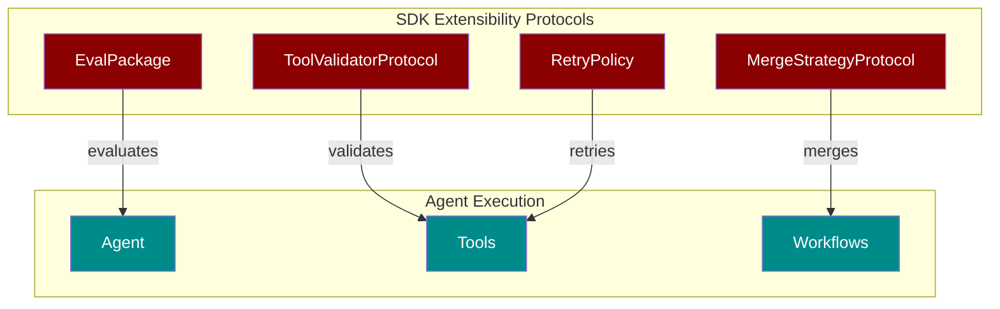
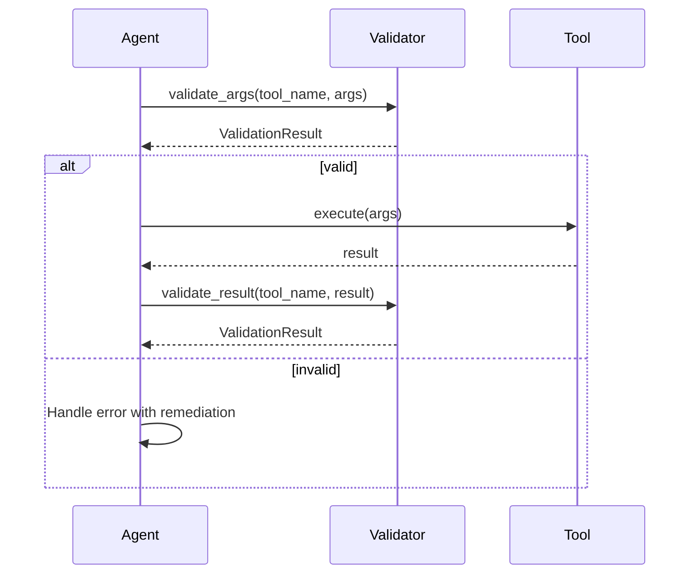
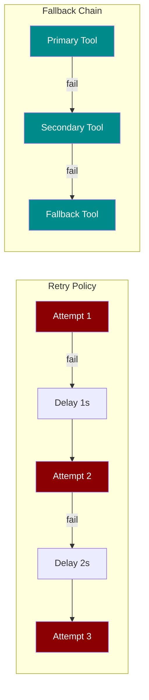
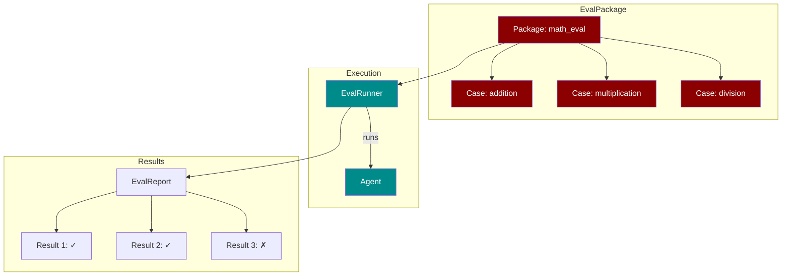
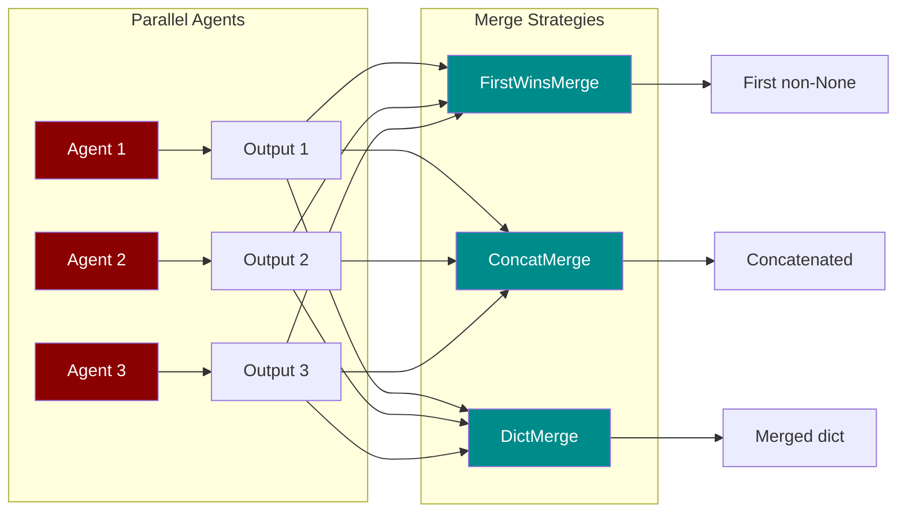

PraisonAI's SDK provides powerful extensibility through **protocol-driven design**. This guide covers the key extensibility features for building production-ready AI agents.

## Overview



<CardGroup cols={2}>
  <Card title="Tool Validation" icon="shield-check" href="#tool-validation">
    Validate tool arguments and results before/after execution
  </Card>
  <Card title="Retry & Fallback" icon="rotate" href="#retry-and-fallback">
    Configure retry policies with exponential backoff and jitter
  </Card>
  <Card title="Evaluation Packages" icon="flask" href="#evaluation-packages">
    Create distributable test suites for agent evaluation
  </Card>
  <Card title="Merge Strategies" icon="code-merge" href="#merge-strategies">
    Combine outputs from parallel multi-agent workflows
  </Card>
</CardGroup>

---

## Tool Validation

Validate tool arguments before execution and results after execution using the `ToolValidatorProtocol`.



### ValidationResult

The `ValidationResult` dataclass captures validation outcomes:

<CodeGroup>
```python Basic Usage
from praisonaiagents.tools import ValidationResult

# Success
result = ValidationResult.success()

# Failure with errors
result = ValidationResult.failure(
    errors=["Invalid argument: query cannot be empty"],
    remediation="Provide a non-empty query string"
)

# Check validity
if not result:
    print(f"Errors: {result.errors}")
    print(f"Fix: {result.remediation}")
```

```python Fluent API
from praisonaiagents.tools import ValidationResult

# Build result incrementally
result = ValidationResult(valid=True)
result.add_warning("Query is very long, may be slow")

if some_condition:
    result.add_error("Missing required field")
    # valid is now False
```
</CodeGroup>

### Custom Validator

Implement `ToolValidatorProtocol` to create custom validators:

```python
from praisonaiagents.tools import ToolValidatorProtocol, ValidationResult

class InputLengthValidator:
    """Validates that string inputs don't exceed max length."""
    
    def __init__(self, max_length: int = 1000):
        self.max_length = max_length
    
    def validate_args(self, tool_name, args, context=None):
        for key, value in args.items():
            if isinstance(value, str) and len(value) > self.max_length:
                return ValidationResult.failure(
                    errors=[f"Argument '{key}' exceeds {self.max_length} chars"],
                    remediation=f"Truncate '{key}' to {self.max_length} characters"
                )
        return ValidationResult.success()
    
    def validate_result(self, tool_name, result, context=None):
        return ValidationResult.success()

# Verify protocol compliance
from praisonaiagents.tools import ToolValidatorProtocol
assert isinstance(InputLengthValidator(), ToolValidatorProtocol)
```

---

## Retry and Fallback

Configure robust tool execution with retry policies and fallback chains.



### RetryPolicy

Configure exponential backoff with optional jitter:

<CodeGroup>
```python Basic Retry
from praisonaiagents.tools import RetryPolicy

# Default: 3 attempts, 2x backoff, 1s initial delay
policy = RetryPolicy()

# Check if should retry
if policy.should_retry("timeout", attempt=1):
    delay = policy.get_delay_ms(attempt=1)  # 2000ms
    print(f"Retrying in {delay}ms...")
```

```python Production Config
from praisonaiagents.tools import RetryPolicy

# Production-ready with jitter to prevent thundering herd
policy = RetryPolicy(
    max_attempts=5,
    backoff_factor=2.0,
    initial_delay_ms=500,
    max_delay_ms=30000,
    retry_on={"timeout", "rate_limit", "connection_error"},
    jitter=True,
    jitter_factor=0.25  # ±25% randomization
)
```
</CodeGroup>

### FallbackChain

Define alternative tools to try if the primary fails:

```python
from praisonaiagents.tools import FallbackChain, ToolExecutionConfig, RetryPolicy

# Define fallback chain
chain = FallbackChain(
    tools=["web_search", "cached_search", "default_response"],
    stop_on_success=True
)

# Combine with retry policy
config = ToolExecutionConfig(
    retry_policy=RetryPolicy(max_attempts=3),
    fallback_chain=chain,
    timeout_ms=5000
)
```

---

## Evaluation Packages

Create distributable evaluation packages to test agent performance.



### Creating an EvalPackage

<CodeGroup>
```python Define Cases
from praisonaiagents.eval import EvalCase, EvalPackage

# Create test cases
cases = [
    EvalCase(
        name="simple_addition",
        input="What is 2 + 2?",
        expected="4",
        criteria=["accuracy", "conciseness"],
        timeout_seconds=10.0
    ),
    EvalCase(
        name="complex_math",
        input="Calculate the square root of 144",
        expected="12",
        criteria=["accuracy"],
        metadata={"difficulty": "medium"}
    ),
]

# Create package
package = EvalPackage(
    name="math_eval",
    description="Basic math evaluation suite",
    version="1.0.0",
    cases=cases,
    thresholds={"accuracy": 0.9, "latency_p95_ms": 1000},
    seed=42  # For reproducibility
)
```

```python Serialize/Deserialize
from praisonaiagents.eval import EvalPackage, EvalCase

# Save to dict (for JSON/YAML storage)
package_dict = package.to_dict()

# Load from dict
restored = EvalPackage.from_dict(package_dict)

# Add cases dynamically
package.add_case(EvalCase(name="new_test", input="What is 10/2?"))
package.add_cases([case1, case2, case3])

print(f"Package has {len(package)} cases")
```
</CodeGroup>

### EvalResult and EvalReport

```python
from praisonaiagents.eval import EvalResult, EvalReport

# Individual result
result = EvalResult(
    case_name="simple_addition",
    passed=True,
    score=1.0,
    actual_output="4",
    latency_ms=150.5,
    criteria_scores={"accuracy": 1.0, "conciseness": 0.9}
)

# Aggregated report
report = EvalReport(
    package_name="math_eval",
    total_cases=10,
    passed_cases=9,
    failed_cases=1,
    average_score=0.92,
    results=[result],
    thresholds_met={"accuracy": True, "latency_p95_ms": True}
)

print(f"Pass rate: {report.pass_rate:.1%}")  # 90.0%
print(f"All passed: {report.all_passed}")    # False
```

---

## Merge Strategies

Combine outputs from multiple agents in parallel workflows.



### Built-in Strategies

<CodeGroup>
```python FirstWinsMerge
from praisonaiagents.agents import FirstWinsMerge

merge = FirstWinsMerge()

# Returns first non-None value
result = merge.merge([None, "first response", "second response"])
print(result)  # "first response"

# All None returns None
result = merge.merge([None, None])
print(result)  # None
```

```python ConcatMerge
from praisonaiagents.agents import ConcatMerge

# Default: double newline separator
merge = ConcatMerge()
result = merge.merge(["Part 1", "Part 2", "Part 3"])
print(result)  # "Part 1\n\nPart 2\n\nPart 3"

# Custom separator
merge = ConcatMerge(separator=" | ")
result = merge.merge(["A", "B", "C"])
print(result)  # "A | B | C"
```

```python DictMerge
from praisonaiagents.agents import DictMerge

# Shallow merge (default)
merge = DictMerge()
result = merge.merge([
    {"name": "Alice", "score": 10},
    {"name": "Bob", "level": 5}
])
print(result)  # {"name": "Bob", "score": 10, "level": 5}

# Deep merge for nested dicts
merge = DictMerge(deep=True)
result = merge.merge([
    {"config": {"a": 1, "b": 2}},
    {"config": {"b": 3, "c": 4}}
])
print(result)  # {"config": {"a": 1, "b": 3, "c": 4}}
```
</CodeGroup>

### Custom Merge Strategy

Implement `MergeStrategyProtocol` for custom logic:

```python
from praisonaiagents.agents import MergeStrategyProtocol

class LongestOutputMerge:
    """Returns the longest output."""
    
    def merge(self, outputs, context=None):
        valid = [o for o in outputs if o is not None]
        if not valid:
            return None
        return max(valid, key=lambda x: len(str(x)))

# Verify protocol compliance
assert isinstance(LongestOutputMerge(), MergeStrategyProtocol)

# Use it
merge = LongestOutputMerge()
result = merge.merge(["short", "medium length", "the longest response here"])
print(result)  # "the longest response here"
```

---

## API Reference

### Tools Module

| Class | Description |
|-------|-------------|
| `ValidationResult` | Result of validation with errors, warnings, remediation |
| `ToolValidatorProtocol` | Protocol for sync validators |
| `AsyncToolValidatorProtocol` | Protocol for async validators |
| `PassthroughValidator` | Default no-op validator |
| `RetryPolicy` | Exponential backoff configuration |
| `FallbackChain` | Alternative tools chain |
| `ToolExecutionConfig` | Combined execution configuration |

### Eval Module

| Class | Description |
|-------|-------------|
| `EvalCase` | Single test case with input/expected |
| `EvalResult` | Result of running one case |
| `EvalReport` | Aggregated results with pass rate |
| `EvalPackage` | Distributable package of cases |
| `EvalRunnerProtocol` | Protocol for running packages |

### Agents Module

| Class | Description |
|-------|-------------|
| `MergeStrategyProtocol` | Protocol for merge strategies |
| `FirstWinsMerge` | Returns first non-None output |
| `ConcatMerge` | Concatenates string outputs |
| `DictMerge` | Merges dictionary outputs |

<Note>
All protocols are `@runtime_checkable`, allowing `isinstance()` checks for protocol compliance.
</Note>
