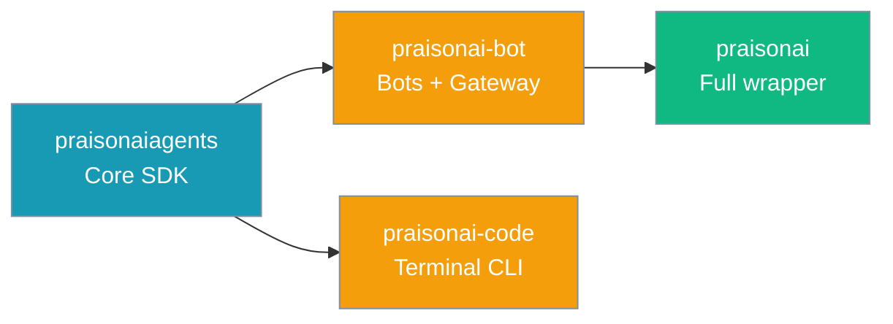

`praisonai-bot` is the channel runtime package: messaging bots (Telegram, Discord, Slack, …), the WebSocket gateway control plane, and the `praisonai-bot` console script. Install it when you need gateway or bots **without** the full `praisonai` wrapper.



## Four-tier ownership

| Package | Owns | Must not depend on |
|---------|------|-------------------|
| `praisonaiagents` | Agent, tools, memory, hooks, bot/gateway **protocols** | `praisonai`, `praisonai-code`, `praisonai-bot` |
| `praisonai-code` | Terminal CLI: `run`/`chat`/`code`, runtime, LLM | PyPI cycle on `praisonai` (lazy bridge only) |
| `praisonai-bot` | Bots, gateway, channel CLI, OS daemon, gateway scheduler tick | PyPI cycle on `praisonai` (lazy bridge for jobs/UI) |
| `praisonai` wrapper | Framework adapters, train, serve, dashboard, async jobs API | — |

**Publish order:** `praisonaiagents` → `praisonai-code` + `praisonai-bot` → `praisonai`

---

## Quick Start

<Steps>
  <Step title="Install">
    ```bash
    pip install praisonaiagents "praisonai-bot[gateway,bot]"
    ```
    <Tip>
    For the four-package overview, see [Installation](/docs/installation).
    </Tip>
  </Step>

  <Step title="Set credentials">
    ```bash
    export OPENAI_API_KEY=your_openai_api_key
    export TELEGRAM_BOT_TOKEN=your_telegram_token   # optional
    ```
  </Step>

  <Step title="Start the gateway">
    ```bash
    praisonai-bot gateway start --host 127.0.0.1 --port 8765
    ```
    Health check: `http://127.0.0.1:8765/health`
  </Step>
</Steps>

---

## Python API (bot-first imports)

```python
from praisonaiagents import Agent
from praisonaiagents.gateway import GatewayConfig
from praisonai_bot.bots import Bot, BotOS
from praisonai_bot.gateway import WebSocketGateway

agent = Agent(name="assistant", instructions="You are helpful.")
gateway = WebSocketGateway(config=GatewayConfig(host="127.0.0.1", port=8765))
gateway.register_agent(agent, agent_id="assistant")

# Shims: ``from praisonai.gateway import WebSocketGateway`` works when the wrapper is installed.
# Shims: ``from praisonai.bots import Bot, BotOS`` also works when the wrapper is installed.
```

### Scheduler imports

```python
from praisonai_bot.scheduler import ScheduledAgentExecutor, JobResult
from praisonai_bot.scheduler.condition_gate import ShellConditionGate
```

<Tip>
Wrapper shims for backward compatibility: `from praisonai.scheduler.executor import ScheduledAgentExecutor, JobResult` and `from praisonai.scheduler.condition_gate import ShellConditionGate` work when `praisonai` is installed alongside `praisonai-bot`.
</Tip>

---

## Scheduled jobs (standalone)

The gateway scheduler tick lives in `praisonai-bot`, so you can run scheduled agents without the full wrapper.

```python
from praisonaiagents import Agent
from praisonaiagents.scheduler import ScheduleRunner, FileScheduleStore
from praisonai_bot.scheduler import ScheduledAgentExecutor

agent = Agent(name="watcher", instructions="Summarise new alerts.")

runner = ScheduleRunner(FileScheduleStore("./schedules"))
executor = ScheduledAgentExecutor(
    runner=runner,
    agent_resolver=lambda _job_id: agent,
)

import asyncio
asyncio.run(executor.run_loop(interval=15.0))
```

<Note>
`RunPolicy` (the safety gate) is not shipped in `praisonai-bot` — install the `praisonai` wrapper if you need it. See [Scheduled Run Policy](/docs/features/scheduled-run-policy).
</Note>

---

## Console script

| Command | Purpose |
|---------|---------|
| `praisonai-bot gateway start` | WebSocket gateway + health endpoint |
| `praisonai-bot bot start` | Single-platform bot |
| `praisonai-bot onboard` | Messaging onboarding wizard |
| `praisonai-bot pairing` | DM pairing allowlist |

When the full wrapper is installed, the same commands are available as `praisonai gateway`, `praisonai bot`, etc.

---

## What is not in this package

- **Agentic hot path** (`run`, `chat`, `code`) — use `praisonai-code` or `praisonai`
- **Framework adapters** (CrewAI, AutoGen) — wrapper only
- **Async jobs HTTP API** (`praisonai.jobs`) — wrapper only (UI bridge when co-installed)
- **Unified dashboard** (`praisonai dashboard`) — wrapper only
- **`RunPolicy`** (safety gate for unattended runs) — wrapper only (`praisonai.scheduler.run_policy`)

---

## When to pick this vs other packages

| Use case | Install |
|----------|---------|
| Gateway + bots only, minimal deps | `pip install "praisonai-bot[gateway,bot]"` |
| Terminal agents without bots | `pip install praisonai-code` |
| Full stack (recommended default) | `pip install praisonai` |
| Embed agents in your app | `pip install praisonaiagents` |

---

## Related

<CardGroup cols={2}>
  <Card title="Installation Guide" icon="download" href="/docs/installation">
    Four-package comparison
  </Card>
  <Card title="Gateway CLI" icon="server" href="/docs/features/gateway-cli">
    Gateway operations
  </Card>
  <Card title="BotOS" icon="robot" href="/docs/features/botos">
    Multi-platform bot orchestration
  </Card>
  <Card title="praisonai SDK" icon="wand-magic-sparkles" href="/docs/sdk/praisonai/index">
    Full wrapper
  </Card>
</CardGroup>
